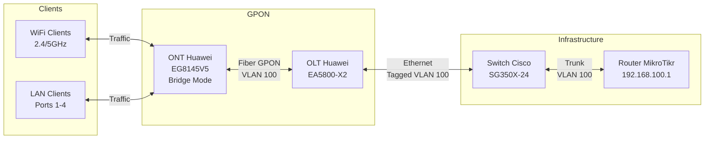
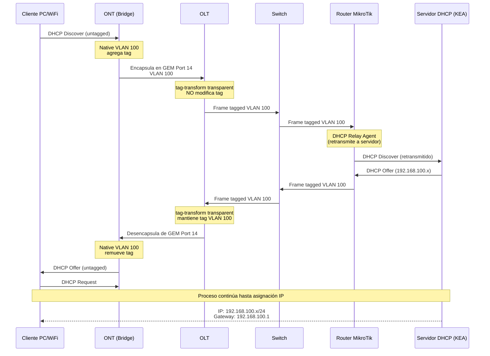

# Infraestructura Red GPON - Dispositivos OLT & ONT

## Implementación de configuraciones

Implementación de una red GPON (Gigabit Passive Optical Network) para entorno académico, integrando dispositivos físicos y servicios virtualizados sobre máquinas virtuales de Ubuntu Server. El proyecto incluye segmentación de red mediante VLANs, servicios core de red, monitoreo y provisión de servicios a clientes finales.

---

## Arquitectura de Red



---

## Dispositivos Configurados

| Device | Model | Role | Management IP |
|--------|-------|------|---------------|
| OLT | Huawei EA5800-X2 | GPON Optical Line Terminal | - |
| ONT | Huawei EG8145V5 | Optical Network Terminal | 192.168.100.254 |
| Switch | Cisco SG350X-24 | Layer 2/3 Switch | - |
| Router | MikroTik | Core Router| 192.168.100.1 |

---

## Estructura GPON: Conceptos Clave

### T-CONT (Transmission Container)

El T-CONT es un buffer lógico que transporta servicios y se utiliza principalmente para transmitir datos upstream. Los T-CONTs permiten la asignación dinámica de ancho de banda (DBA) para optimizar la utilización del enlace.

| Type | Name | Guarantee | Use Case |
|------|------|-----------|----------|
| 1 | Fixed | Ancho de banda fijo y completamente reservado | Servicios críticos sensibles a latencia (telefonía, video en vivo) |
| 2 | Assured | Mínimo garantizado, capacidad sobrante disponible para otros | Aplicaciones con SLA estricto que pueden aprovechar capacidad extra |
| 3 | Non-assured | Sin garantía fija, puede usar capacidad restante hasta un máximo | Datos importantes sin reserva pero con límite superior |
| 4 | Best-effort | Sin garantía ni límite, usa lo disponible | Tráfico de baja prioridad |
| 5 | Mixed | Combina varios tipos anteriores en una sola cola | ONUs con servicios diversos (voz, datos, IPTV) |

### GEM Port (GPON Encapsulation Method Port)

Unidad mínima para transporte de servicios. La relación con T-CONTs es uno a muchos (un T-CONT puede contener múltiples GEM Ports).

#### Modificadores de Configuración GEM Port

| Modifier | Description |
|----------|-------------|
| `cascade` | Permite al GEM Port reenviar tráfico a otra OLT en arquitecturas en cascada |
| `downstream-priority-queue` | Asigna el tráfico downstream del GEM Port a una cola de prioridad específica |
| `encrypt` | Activa encriptación OMCI en este GEM Port |
| `gem-car` | Habilita control CAR (Committed Access Rate) definiendo CIR y PIR |
| `priority-queue` | Selecciona la cola de prioridad upstream para el tráfico de este GEM Port |

### Dynamic Bandwidth Assignment (DBA)

DBA se basa en la asignación de ancho de banda en intervalos de microsegundos:

1. La OLT incluye el mapa de asignación de ancho de banda (BW Map) en la cabecera de tramas downstream
2. La ONU envía un reporte de estado con datos pendientes en su T-CONT durante la ventana de tiempo indicada
3. La OLT recibe el reporte, ejecuta el algoritmo DBA, actualiza el BW Map y lo inserta en la siguiente trama downstream
4. La ONU recibe el nuevo BW Map y transmite sus datos en las ranuras asignadas

---

## Configuración Implementada

### Configuración en OLT (Huawei EA5800-X2)

#### 1. Perfiles DBA

```shell
EA5800-X2(config)# dba-profile add profile-id 12 profile-name "ftthdba" type3 assure 8192 max 97280
```

**Parámetros configurados:**
- Type 3: Non-assured (sin garantía fija)
- Assure: 8192 kbps (8 Mbps garantizados)
- Max: 97280 kbps (95 Mbps máximo)

#### 2. Line Profile

```shell
EA5800-X2(config)# ont-lineprofile gpon profile-id 3 profile-name "ftth"
EA5800-X2(ont-lineprofile-3)# omcc encrypt on
EA5800-X2(ont-lineprofile-3)# tcont 4 dba-profile-id 12
EA5800-X2(ont-lineprofile-3)# gem add 14 eth tcont 4 encrypt on
EA5800-X2(ont-lineprofile-3)# gem add 15 eth tcont 4 encrypt on
EA5800-X2(ont-lineprofile-3)# gem mapping 14 0 vlan 100
EA5800-X2(ont-lineprofile-3)# commit
EA5800-X2(ont-lineprofile-3)# quit
```

**Explicación:**
- `omcc encrypt on`: Habilita encriptación OMCI para seguridad del canal de gestión
- `tcont 4`: Crea T-CONT con ID 4 asociado al DBA profile 12
- `gem add 14`: Crea GEM Port 14 tipo Ethernet en T-CONT 4 con encriptación
- `gem add 15`: Crea GEM Port 15 adicional (reservado para servicios futuros)
- `gem mapping 14 0 vlan 100`: Mapea GEM Port 14 a VLAN 100

#### 3. Service Profile

```shell
EA5800-X2(config)# ont-srvprofile gpon profile-id 3 profile-name "ftth"
EA5800-X2(config-gpon-srvprofile-3)# ont-port eth adaptive 8
EA5800-X2(config-gpon-srvprofile-3)# transparent enable
EA5800-X2(config-gpon-srvprofile-3)# commit
EA5800-X2(config-gpon-srvprofile-3)# quit
```

**Nota:**
- `ont-port eth adaptive 8`: Activa hasta 8 puertos Ethernet en modo adaptativo
- `transparent enable`: Habilita transmisión transparente de paquetes en la ONT

#### 4. Creación de VLAN

```shell
EA5800-X2(config)# vlan 10 smart
EA5800-X2(config)# vlan 100 smart
```

**Nota:** VLAN smart permite asignación flexible a interfaces trunk, access o service-ports GPON.

#### 5. Aprovisionamiento de ONT

```shell
EA5800-X2(config)# interface gpon 0/1
EA5800-X2(config-if-gpon-0/1)# ont add 0 1 sn-auth "485754436B886FA5" omci ont-lineprofile-id 3 ont-srvprofile-id 3 desc "ONT_NO_DESCRIPTION"
```

**Parámetros:**
- Puerto GPON: 0/1
- PON Port: 0
- ONT ID: 1
- Serial Number: 485754436B886FA5
- Protocolo: OMCI (ONU Management and Control Interface)

#### 6. Service Port

```shell
EA5800-X2(config)# service-port 4 vlan 100 gpon 0/1/0 ont 1 gemport 14 multi-service user-vlan 100 tag-transform transparent inbound traffic-table index 200 outbound traffic-table index 200
```

**Funcionamiento de `tag-transform transparent`:**

| Direction                        | Behavior                                                                     |
| -------------------------------- | ---------------------------------------------------------------------------- |
| Upstream (ONT → OLT → Network)   | Recibe frames del GEM Port 14 y los transmite sin modificar el tag VLAN      |
| Downstream (Network → OLT → ONT) | Recibe frames VLAN 100 y los transmite sin modificación hacia el GEM Port 14 |

A diferencia de `translate`, el modo `transparent` NO modifica los tags VLAN, manteniendo la estructura original de etiquetado

**Traffic Table Index 200**
- Aplica control de tráfico tanto en dirección inbound como outbound
- CIR: 10240 kbps (10 Mbps garantizado)
- PIR: 102400 kbps (100 Mbps burst máximo)

#### 7. Configuración de Native VLAN en Puertos ONT

```shell
EA5800-X2(config-if-gpon-0/1)# ont port native-vlan 0 1 eth 1 vlan 100 priority 0
EA5800-X2(config-if-gpon-0/1)# ont port native-vlan 0 1 eth 2 vlan 100 priority 0
EA5800-X2(config-if-gpon-0/1)# ont port native-vlan 0 1 eth 3 vlan 100 priority 0
EA5800-X2(config-if-gpon-0/1)# ont port native-vlan 0 1 eth 4 vlan 100 priority 0
```

**Efecto:** Todos los puertos Ethernet de la ONT tratan el tráfico untagged como VLAN 100.

#### 8. Configuración de Puerto Uplink

```shell
EA5800-X2(config)# port vlan 100 0/3 0
EA5800-X2(config)# port vlan 100 0/4 1
EA5800-X2(config)# port vlan 10 0/4 1
```

**Explicación:**
- Puerto 0/3/0: Uplink principal para VLAN 100 (tráfico clientes)
- Puerto 0/4/1: Uplink secundario para VLAN 100 y VLAN 10 (gestión)

#### 9. Interface de Gestión
```shell
EA5800-X2(config)# interface Vlanif10
EA5800-X2(config-if-Vlanif10)# ip address 192.168.10.250 255.255.255.0 description "OLT_Management_Interface"
EA5800-X2(config-if-Vlanif10)# quit
```

#### 10. Ruta Estática
```shell
EA5800-X2(config)# ip route-static 0.0.0.0 0.0.0.0 192.168.10.1
```

---

### Configuración en ONT (Huawei EG8145V5)

La configuración de la ONT se realizó mediante interfaz web con usuario administrador.

#### 1. Cambio de Modo de Gestión

**Ubicación:** Management → Management Mode Selection

- Desmarcar: "On the OLT"
- Marcar: "On the ONT web page"

**Propósito:** Permite configuración manual desde la interfaz web sin sobrescritura por OMCI.

#### 2. Habilitación de Puertos LAN

**Ubicación:** LAN → LAN Port Work Mode

- Habilitar puertos LAN1, LAN2, LAN3, LAN4 en modo Layer 2/3

**Nota:** Por defecto, los puertos pueden estar deshabilitados tras reset de fábrica.

#### 3. Configuración WAN en Modo Bridge

**Ubicación:** WAN → WAN Configuration → New

| Parameter          | Value                                                |
| ------------------ | ---------------------------------------------------- |
| Enable WAN         | Checked                                              |
| Encapsulation Mode | IPoE                                                 |
| Protocol Type      | IPv4                                                 |
| WAN Mode           | Bridge WAN                                           |
| Service Type       | INTERNET                                             |
| Enable VLAN        | Checked                                              |
| VLAN ID            | 100                                                  |
| 802.1p Priority    | 0                                                    |
| Binding Options    | LAN1, LAN2, LAN3, LAN4, SSID1 (2.4GHz), SSID5 (5GHz) |

Al seleccionar "Bridge WAN", la sección de configuración IPv4 desaparece, lo cual es correcto.

#### 4. Desactivación del Servidor DHCP

**Ubicación:** LAN → DHCP Server Configuration

- Desmarcar: "Enable Primary DHCP Server"
- Desmarcar: "Enable DHCP Relay"

**Propósito:** La ONT actúa como bridge transparente. El servidor DHCP es el router MikroTik.

---

### Configuración en Switch (Cisco SG350X-24)

#### Puerto hacia OLT (GigabitEthernet1/0/1)

```shell
interface GigabitEthernet1/0/1
description OLT_UPLINK
switchport mode trunk
switchport trunk allowed vlan add 100
spanning-tree link-type point-to-point
```
 NO configurar native VLAN en este puerto. El OLT envía tráfico tagged VLAN 100.

#### Puerto hacia Router (GigabitEthernet1/0/2)

```shell
interface GigabitEthernet1/0/2
description ROUTER_LAN
switchport mode trunk
switchport trunk allowed vlan add 100
spanning-tree link-type point-to-point
```

Modo trunk permite múltiples VLANs entre switch y router


---

## Flujo de Tráfico en Modo Bridge



---

## Configuración de Perfiles: Resumen

### DBA Profile (ID 12)

| Parameter    | Value           | Description                                            |
| ------------ | --------------- | ------------------------------------------------------ |
| Profile ID   | 12              | Identificador único                                    |
| Profile Name | ftthdba         | Nombre descriptivo                                     |
| Type         | 3 (Non-assured) | Sin garantía fija, usa capacidad restante hasta máximo |
| Assure       | 8192 kbps       | Ancho de banda garantizado (8 Mbps)                    |
| Max          | 97280 kbps      | Límite máximo de ancho de banda (95 Mbps)              |

### Line Profile (ID 3)

| Component | ID | DBA Profile | VLAN Mapping  | Encryption |
| --------- | -- | ----------- | ------------- | ---------- |
| T-CONT    | 4  | 12          | -             | OMCI ON    |
| GEM Port  | 14 | -           | 100           | ON         |
| GEM Port  | 15 | -           | (Sin asignar) | ON         |

**Características:**
- Encriptación OMCI habilitada a nivel de line profile
- Tipo de tráfico: Ethernet
- Mapping index: 0

### Service Profile (ID 3)

| Port Type            | Configuration                                 |
| -------------------- | --------------------------------------------- |
| Ethernet             | Adaptive (max 8 ports)                        |
| Native VLAN          | Concern (considera configuración native VLAN) |
| Transparent Function | Enable                                        |
| MAC Learning         | Enable                                        |

---

## Verificación de Configuración

### En la OLT

#### Verificar Service Port

```shell
EA5800-X2(config)# display service-port all
```

**Salida esperada:**
```
INDEX VLAN PORT    F/S/P VPI VCI FLOW FLOW   RX TX STATE
      ID           TYPE           TYPE PARA
-----------------------------------------------------------
4     100  gpon    0/1/0 -   14  vlan 100    200 200 up

```

**Estado correcto**: STATE = up, RX/TX = 200 (traffic-table index)

#### Verificar ONT

```shell
EA5800-X2(config-if-gpon-0/1)# display ont info 0 1
```

**Parámetros clave a verificar:**
- Run state: online
- Config state: normal
- Management mode: OMCI
- ONT distance: ~33m (varía según instalación)

#### Verificar VLAN

```shell
EA5800-X2(config)# display vlan 100
```

**Verificar que aparezcan:**
- Service virtual port: index 4
- Standard ports: 0/3/0, 0/4/1 (uplink)

#### Verificar Interface de Gestión
```shell
EA5800-X2(config)# display ip interface brief
```

Vlanif10: 192.168.10.250/24, Status: UP


### En el Switch

#### Verificar Configuración de Puerto

```shell
show running-config interface gigabitethernet1/0/1
```

**Debe mostrar:**
- `switchport mode trunk`
- `switchport trunk allowed vlan` incluye 100

#### Verificar Tabla MAC

```shell
show mac address-table vlan 100
```

**Debe mostrar:** Direcciones MAC de clientes conectados a la ONT aprendidas en Gi1/0/1.

### En la ONT (Interfaz Web)

**Verificar en Status → WAN Information:**
- Debe aparecer una conexión en modo Bridge
- VLAN: 100
- Status: Connected

**Verificar en Status → Ethernet Port:**
- Puertos LAN1-4 deben mostrar "Up" cuando hay dispositivos conectados

### En Clientes

#### Verificar Asignación IP

**Windows:**
```cmd
ipconfig
```

**Linux:**
```bash
ip addr show
```

**Salida esperada:**
- IP: 192.168.100.x
- Máscara: 255.255.255.0
- Gateway: 192.168.100.1
- DNS: 192.168.20.20
#### Verificar Conectividad

```cmd
ping 192.168.100.1
ping 8.8.8.8
```

---

## Resolución de Problemas Comunes

### Problema: Cliente no obtiene IP

**Diagnóstico:**

1. Verificar service-port en OLT: `display service-port all` debe mostrar STATE = up
2. Verificar ONT online: `display ont info 0 1` debe mostrar Run state = online
3. Verificar servidor DHCP de ONT desactivado (interfaz web ONT)
4. Verificar tabla MAC en switch: `show mac address-table vlan 100`

**Solución:**
- Si service-port está down: revisar line profile y GEM port mapping
- Si ONT offline: verificar fibra y potencia óptica
- Si DHCP de ONT activo: desactivarlo en configuración LAN
- Si MAC no aparece en switch: revisar binding options en WAN de la ONT

### Problema: Cliente obtiene IP 192.168.18.x

**Causa:** Servidor DHCP de la ONT aún activo o DHCP Relay habilitado.

**Solución:**
1. Acceder a ONT como administrador
2. LAN → DHCP Server Configuration
3. Desmarcar "Enable Primary DHCP Server"
4. Desmarcar "Enable DHCP Relay"
5. Apply y reiniciar ONT

### Problema: Switch no acepta VLAN tagged de OLT

**Causa:** Puerto configurado con "native VLAN" cuando debería ser trunk puro.

**Solución:**
```shell
configure terminal
interface GigabitEthernet1/0/1
no switchport trunk native vlan
switchport mode trunk
switchport trunk allowed vlan add 100
end
```

---

## Características Técnicas Finales

| Parameter             | Value                                  |
| --------------------- | -------------------------------------- |
| GPON Wavelength       | 1490nm (downstream), 1310nm (upstream) |
| Maximum Distance      | 20 km (máximo estándar GPON)           |
| Actual Distance       | 33 m                                   |
| TX Optical Power      | 2.26 dBm                               |
| RX Optical Power      | -19.66 dBm                             |
| Encryption            | OMCI Encryption enabled                |
| VLAN ID               | 100                                    |
| Client Network        | 192.168.100.0/24                       |
| DHCP Range            | 192.168.100.2 - 192.168.100.253        |
| Gateway               | 192.168.100.1 (MikroTik Router)        |
| ONT Management IP     | 192.168.100.254                        |
| OLT Management IP     | 192.168.10.250                         |
| OLT Management VLAN   | 10                                     |
| Traffic Profile CIR   | 10 Mbps                                |
| Traffic Profile PIR   | 100 Mbps                               |
| DBA Assured Bandwidth | 8 Mbps                                 |
| DBA Maximum Bandwidth | 95 Mbps                                |

---

## Referencias

- Huawei MA5800 Series OLT Configuration Guide
- IEEE 802.1Q VLAN Tagging Standard
- ITU-T G.984 GPON Recommendations
- Cisco SG350X Administration Guide


