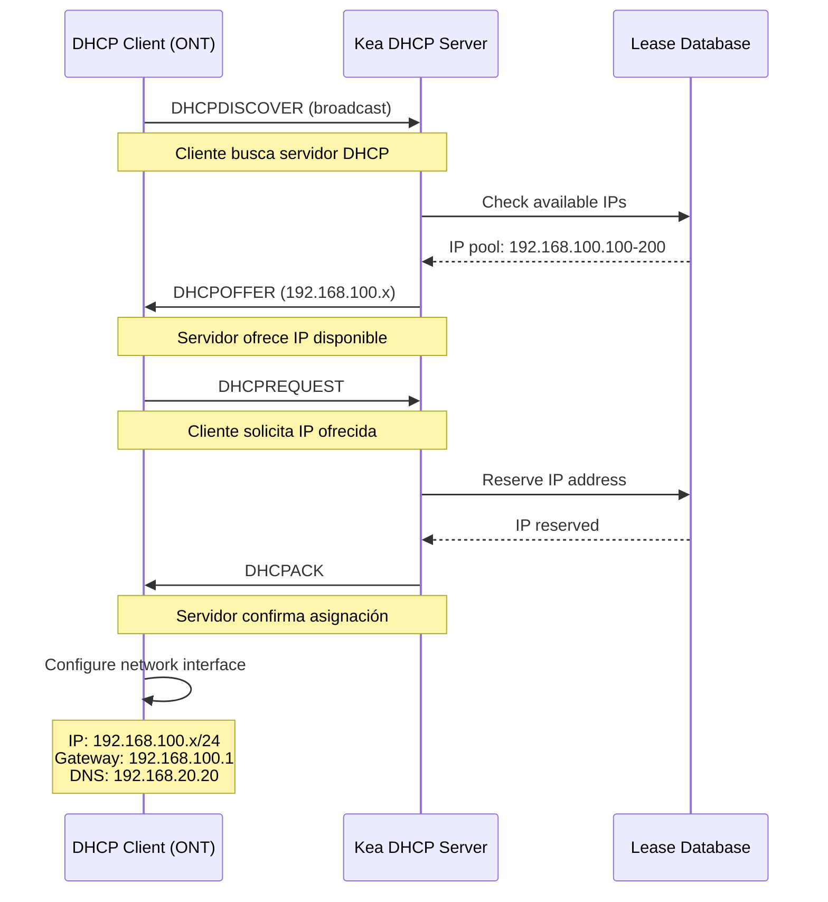
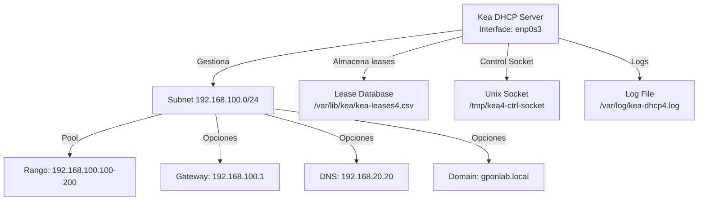
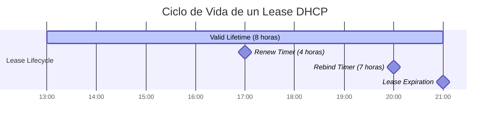
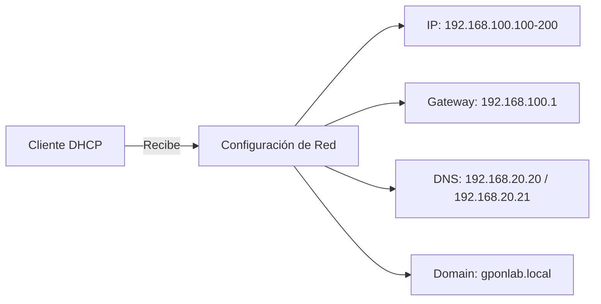
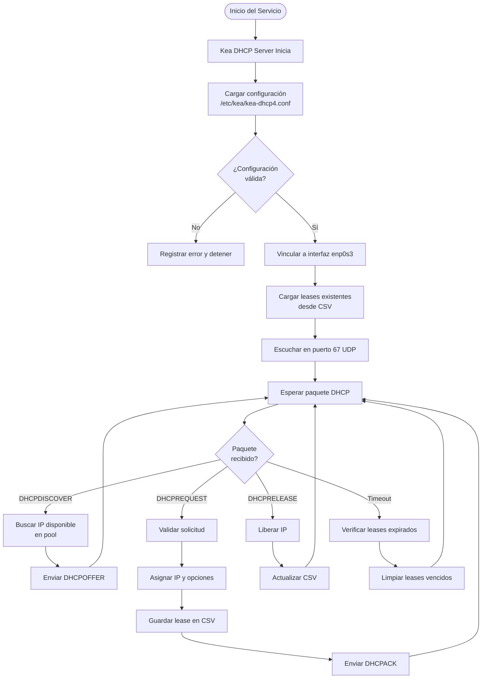
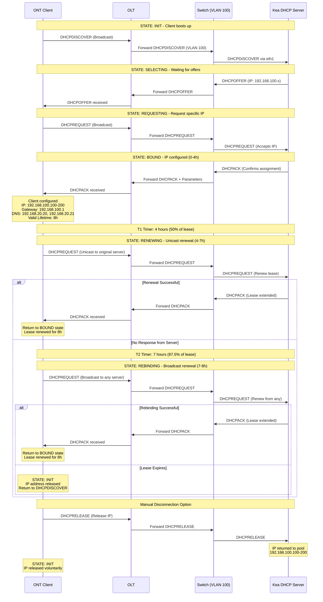

# Infraestructura Red GPON - SERVICIO DHCP KEA
## 1. INTRODUCCIÓN AL SERVICIO DHCP

Este documento describe la implementación y configuración del servicio DHCP utilizando **Kea DHCP Server** en una infraestructura de red GPON. El servidor DHCP se encuentra alojado en un equipo con Ubuntu Server, proporcionando asignación dinámica de direcciones IP a los clientes conectados a través de las ONTs en la VLAN 100.

## 2. PROCESO DHCP - SECUENCIA DORA

El protocolo DHCP utiliza un proceso de cuatro fases conocido como DORA (Discovery, Offer, Request, Acknowledgement) para asignar direcciones IP a los clientes. 

**Puertos UDP Utilizados**
El servicio DHCP opera mediante el protocolo UDP en dos puertos específicos:​
- Puerto 67: Escucha del servidor DHCP (Kea)
- Puerto 68: Escucha del cliente DHCP (ONTs)

---

## Instalación del Servidor Kea DHCP

### Requisitos Previos

- Sistema operativo: Ubuntu Server
- Acceso root o privilegios sudo
- Conectividad de red configurada

### Procedimiento de Instalación

Para instalar Kea DHCP Server, se ejecutaron los siguientes comandos:

```bash
sudo apt update
sudo apt install kea-dhcp4-server isc-kea-admin -y
```

Estos paquetes incluyen:
- **kea-dhcp4-server**: Servidor DHCP IPv4
- **isc-kea-admin**: Herramientas administrativas para gestión de base de datos y configuración

---

## Arquitectura del Servicio DHCP

### Diagrama de Flujo del Proceso DHCP

El siguiente diagrama ilustra el proceso completo de asignación de direcciones IP mediante el protocolo DHCP:



### Diagrama de Componentes del Sistema



---

## Configuración del Servidor

### Archivo de Configuración Principal

La configuración del servidor DHCP se encuentra en el archivo `/etc/kea/kea-dhcp4.conf`. A continuación se detalla cada sección de la configuración implementada:

### Sección: Interfaces de Red

```json
"interfaces-config": {
    "interfaces": ["enp0s3"],
    "dhcp-socket-type": "udp",
    "service-sockets-max-retries": 5000,
    "service-sockets-retry-wait-time": 5000
}
```

**Descripción de parámetros:**

- **interfaces**: Define la interfaz de red en la que el servidor DHCP escuchará peticiones. En este caso, `enp0s3` es la interfaz conectada al switch que da acceso a la VLAN 100.
- **dhcp-socket-type**: Especifica el tipo de socket UDP para comunicación DHCP estándar.
- **service-sockets-max-retries**: Número máximo de reintentos para abrir el socket de servicio (5000).
- **service-sockets-retry-wait-time**: Tiempo de espera en milisegundos entre reintentos (5000 ms = 5 segundos).

### Sección: Temporizadores de Lease

```json
"valid-lifetime": 28800,
"renew-timer": 14400,
"rebind-timer": 25200
```



**Descripción de parámetros:**

- **valid-lifetime** (28800 segundos = 8 horas): Tiempo total de validez de una concesión de dirección IP.
- **renew-timer** (14400 segundos = 4 horas): Tiempo después del cual el cliente intenta renovar su lease con el servidor que le asignó la IP.
- **rebind-timer** (25200 segundos = 7 horas): Si no puede renovar con el servidor original, el cliente intenta contactar cualquier servidor DHCP disponible.

### Sección: Base de Datos de Leases

```json
"lease-database": {
    "type": "memfile",
    "persist": true,
    "name": "/var/lib/kea/kea-leases4.csv",
    "lfc-interval": 3600
}
```

**Descripción de parámetros:**

- **type**: `memfile` indica almacenamiento en memoria con persistencia en archivo CSV.
- **persist**: Habilita la escritura de leases en disco para recuperación tras reinicios.
- **name**: Ruta del archivo CSV donde se almacenan los leases activos.
- **lfc-interval** (3600 segundos = 1 hora): Intervalo para la limpieza de archivo de leases (Lease File Cleanup), eliminando registros expirados.

### Sección: Socket de Control

```json
"control-socket": {
    "socket-type": "unix",
    "socket-name": "/tmp/kea4-ctrl-socket"
}
```

**Descripción:**

El socket de control permite la gestión y monitoreo del servidor mediante comandos administrativos. Se utiliza un socket Unix local para mayor seguridad y rendimiento.

### Sección: Registro de Logs

```json
"loggers": [
    {
        "name": "kea-dhcp4",
        "output_options": [
            {
                "output": "/var/log/kea-dhcp4.log"
            }
        ],
        "severity": "DEBUG",
        "debuglevel": 99
    }
]
```

**Descripción de parámetros:**

- **name**: Identificador del logger para el servicio DHCPv4.
- **output**: Archivo de destino para los logs (`/var/log/kea-dhcp4.log`).
- **severity**: Nivel de registro configurado en `DEBUG` para máximo detalle.
- **debuglevel**: Nivel de verbosidad del debug (99 = máximo detalle).

**Nota**: En producción se recomienda usar severity `INFO` o `WARN` para evitar logs excesivos.

---

## Configuración de Subred y Pool de Direcciones

### Subnet 192.168.100.0/24

```json
"subnet4": [
    {
        "subnet": "192.168.100.0/24",
        "id": 1,
        "pools": [ 
            { "pool": "192.168.100.100 - 192.168.100.200" } 
        ],
        "option-data": [
            {
                "name": "routers",
                "data": "192.168.100.1"
            },
            {
                "name": "domain-name-servers",
                "data": "192.168.20.20. 192.168.20.21"
            },
            {
                "name": "domain-search",
                "data": "gponlab.local"
            }
        ]
    }
]
```

### Parámetros de la Subred

| Parámetro | Valor | Descripción |
|-----------|-------|-------------|
| **subnet** | 192.168.100.0/24 | Red completa administrada por el servidor DHCP |
| **id** | 1 | Identificador único de la subred |
| **pool** | 192.168.100.100 - 192.168.100.200 | Rango de 101 direcciones IP disponibles para asignación dinámica |

### Opciones DHCP Configuradas



#### Option 3: Routers (Default Gateway)

```json
{
    "name": "routers",
    "data": "192.168.100.1"
}
```

Define la puerta de enlace predeterminada para los clientes. Todo el tráfico destinado fuera de la subred 192.168.100.0/24 será enrutado a través de esta dirección.

#### Option 6: Domain Name Servers

```json
{
    "name": "domain-name-servers",
    "data": "192.168.20.20, 192.168.20.21"
}
```

Configura el servidor DNS que los clientes utilizarán para resolución de nombres de dominio. En este caso, apunta a los servidores DNS primario y secundiario.

#### Option 119: Domain Search

```json
{
    "name": "domain-search",
    "data": "gponlab.local"
}
```

Establece el dominio de búsqueda predeterminado. Los clientes agregarán automáticamente `.gponlab.local` a nombres de host no cualificados durante la resolución DNS.

---

## Gestión y Administración del Servicio

### Comandos de Gestión del Servicio

#### Iniciar el servicio

```bash
sudo systemctl start kea-dhcp4-server
```

#### Detener el servicio

```bash
sudo systemctl stop kea-dhcp4-server
```

#### Reiniciar el servicio

```bash
sudo systemctl restart kea-dhcp4-server
```

#### Verificar estado del servicio

```bash
sudo systemctl status kea-dhcp4-server
```

#### Habilitar inicio automático

```bash
sudo systemctl enable kea-dhcp4-server
```

### Validación de la Configuración

Antes de iniciar o reiniciar el servicio, es fundamental validar la sintaxis del archivo de configuración:

```bash
kea-dhcp4 -t /etc/kea/kea-dhcp4.conf
```

Si la configuración es correcta, el comando mostrará un mensaje de éxito. En caso de errores, indicará la línea y el problema específico.

---

## Monitoreo y Verificación

### Consulta de Leases Activos

Los leases asignados se almacenan en formato CSV y pueden consultarse directamente:

```bash
cat /var/lib/kea/kea-leases4.csv
```

### Formato del Archivo de Leases

El archivo CSV contiene los siguientes campos:

| Campo | Descripción |
|-------|-------------|
| **address** | Dirección IP asignada al cliente |
| **hwaddr** | Dirección MAC del cliente |
| **client_id** | Identificador único del cliente DHCP |
| **valid_lifetime** | Tiempo de validez del lease en segundos |
| **expire** | Timestamp Unix de expiración del lease |
| **subnet_id** | ID de la subred a la que pertenece |
| **fqdn_fwd** | Forward DNS update (0 o 1) |
| **fqdn_rev** | Reverse DNS update (0 o 1) |
| **hostname** | Nombre del host del cliente |
| **state** | Estado del lease (0 = default) |
| **user_context** | Contexto adicional definido por usuario |

### Ejemplo de Lease

```csv
192.168.100.105,a4:12:42:8f:c3:1a,01:a4:12:42:8f:c3:1a,28800,1731789245,1,0,0,ont-client-01,0,
```

### Análisis de Logs

Para monitorear la actividad del servidor en tiempo real:

```bash
tail -f /var/log/kea-dhcp4.log
```

Para buscar eventos específicos (por ejemplo, asignaciones nuevas):

```bash
grep "DHCPACK" /var/log/kea-dhcp4.log
```

---

## Flujo de Operación del Servicio



## Diagrama de Secuencia Completo



---

## Referencias y Recursos

- Documentación oficial de Kea DHCP: https://kea.readthedocs.io/
- RFC 2131: Dynamic Host Configuration Protocol
- RFC 2132: DHCP Options and BOOTP Vendor Extensions
- ISC Kea GitHub Repository: https://github.com/isc-projects/kea

---


