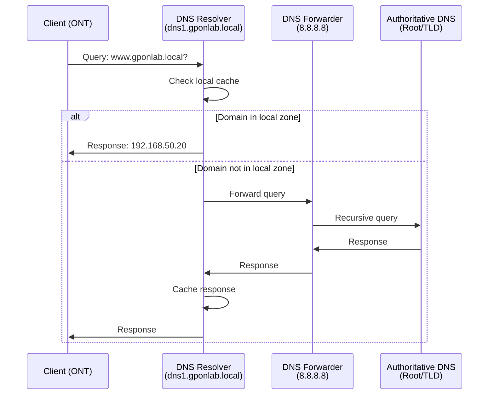
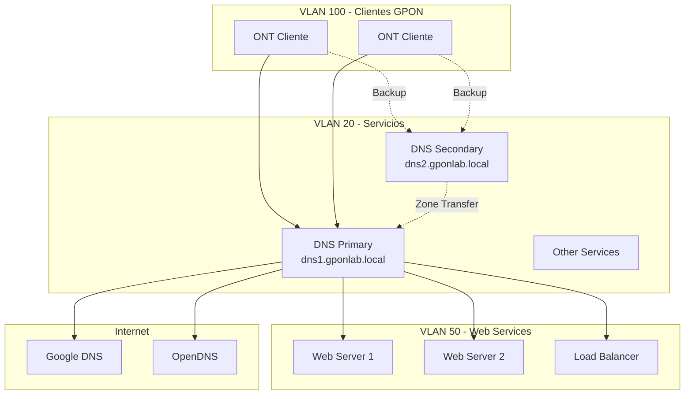
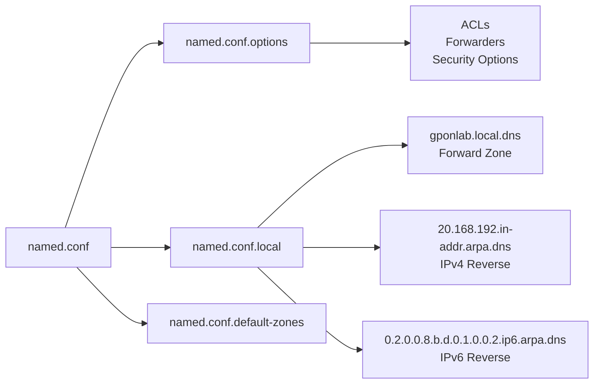
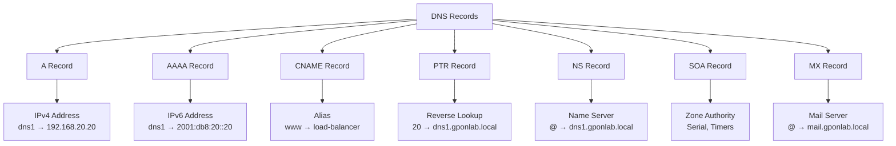
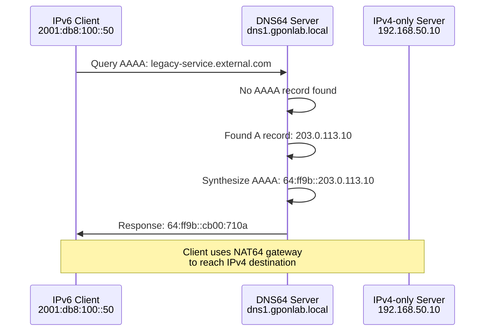

# Infraestructura Red GPON - SERVICIO DNS
## Implementación DNS con BIND9

---

## ¿Qué es DNS?

El **Sistema de Nombres de Dominio** (DNS, por sus siglas en inglés de Domain Name System) es un protocolo de Internet que actúa como una "guía telefónica" para la red. Su función principal es traducir nombres de dominio legibles por humanos (como `gponlab.local`) en direcciones IP numéricas (como `192.168.20.20`) que las computadoras utilizan para identificarse y comunicarse entre sí.

---

## Funcionamiento del DNS

El proceso de resolución DNS funciona mediante una consulta jerárquica que involucra varios componentes trabajando en conjunto:



### Proceso de Resolución

1. **Consulta del cliente**: Un dispositivo cliente (como una ONT en la red GPON) solicita resolver un nombre de dominio.

2. **Verificación de caché**: El servidor DNS primero verifica si la respuesta está almacenada en su caché local. Si existe y no ha expirado, la devuelve inmediatamente.

3. **Consulta local o recursiva**: Si el dominio pertenece a una zona autoritativa local (como `gponlab.local`), el servidor responde directamente. Si no, realiza consultas recursivas a otros servidores DNS.

4. **Forwarders**: Si está configurado, el servidor DNS puede delegar consultas externas a servidores forwarders (como `8.8.8.8` de Google o `208.67.220.220` de OpenDNS).

5. **Respuesta y almacenamiento**: Una vez obtenida la respuesta, se almacena en caché según el valor TTL y se devuelve al cliente.

---

## Arquitectura DNS en la Red GPON

La implementación DNS en nuestra infraestructura GPON utiliza una arquitectura redundante con servidores primario y secundario:



### Componentes de la Arquitectura

**Servidor DNS Primario** (`dns1.gponlab.local`): Servidor autoritativo principal para la zona `gponlab.local`. Mantiene los archivos de zona maestros y responde consultas de clientes en las VLANs configuradas.

**Servidor DNS Secundario** (`dns2.gponlab.local`): Servidor de respaldo que obtiene copias de las zonas mediante transferencias desde el servidor primario. Proporciona redundancia y balanceo de carga.

**Zonas Configuradas**: Se configuraron zonas directas (forward) e inversas (reverse) para IPv4 e IPv6, permitiendo resolución bidireccional.

**Forwarders Externos**: Para consultas de dominios externos, el servidor utiliza DNS públicos como Google (`8.8.8.8`, `8.8.4.4`) y OpenDNS (`208.67.220.220`).

---

## Instalación de BIND9

BIND9 ([translate:Berkeley Internet Name Domain]) es la implementación de servidor DNS más utilizada en sistemas Linux y Unix. Para instalarlo en Ubuntu Server:

```bash
sudo apt update
sudo apt install bind9 bind9-utils bind9-doc
```

### Verificación de la Instalación

Después de la instalación, se puede verificar el estado del servicio:

```bash
sudo systemctl status bind9
```

Los archivos de configuración se encuentran en el directorio `/etc/bind/`.

---

## Estructura de Archivos de Configuración

La configuración de BIND9 se distribuye en varios archivos con propósitos específicos:



### Archivos Principales

**`named.conf`**: Archivo principal que incluye otros archivos de configuración mediante directivas `include`.

**`named.conf.options`**: Contiene opciones globales del servidor, incluyendo forwarders, ACLs, seguridad y configuración de red.

**`named.conf.local`**: Define las zonas locales administradas por el servidor (zonas autoritativas).

**Archivos de Zona**: Contienen los registros DNS específicos para cada zona configurada.

---

## Configuración del Servidor

### Archivo: named.conf.options

Este archivo contiene la configuración principal del servidor DNS, incluyendo opciones de red, seguridad y comportamiento:

```bash
options {
    directory "/var/cache/bind";

    # Servidores DNS a los que se reenvían consultas externas
    forwarders {
        8.8.8.8;
        8.8.4.4;
        208.67.220.220;
    };

    # Validación DNSSEC automática
    dnssec-validation auto;

    # Interfaces de escucha IPv4
    listen-on port 53 { 192.168.20.20; 127.0.0.1; };

    # Interfaces de escucha IPv6
    listen-on-v6 port 53 { 2001:db8:20::20; ::1; };

    # Habilitar consultas recursivas
    recursion yes;

    # Control de acceso mediante ACLs
    allow-recursion { trusted-hosts; };
    allow-query { trusted-hosts; };
    allow-transfer { secondary-servers; };

    # Configuración DNS64 para traducción IPv6 a IPv4
    dns64 64:ff9b::/96 {
        clients { any; };
        mapped { any; };
        exclude { 0::/3; 2001:db8::/32; };
        break-dnssec yes;
    };
};
```

### Listas de Control de Acceso (ACLs)

Las ACLs definen qué clientes pueden realizar diferentes tipos de consultas:

```bash
acl "trusted-hosts" {
    localhost;           # Servidor local
    localnets;          # Redes locales automáticas
    192.168.20.0/24;    # VLAN 20 - Servicios
    2001:db8:20::/64;   # IPv6 VLAN 20
    192.168.100.0/24;   # VLAN 100 - Clientes GPON
    192.168.50.0/24;    # VLAN 50 - Servidores Web
    192.168.40.0/24;    # VLAN 40 - Mail
};

acl "secondary-servers" {
    192.168.20.21;      # DNS secundario
};
```

---

## Tipos de Registros DNS

Los registros DNS son entradas en la base de datos que mapean nombres a recursos. Nuestra implementación utiliza los siguientes tipos:



### Registro SOA (Start of Authority)

Define información autoritativa sobre la zona:

```bash
@       IN      SOA     dns1.gponlab.local. admin.gponlab.local. (
                        2025110502   ; Serial (YYYYMMDDNN)
                        86400        ; Refresh (24 horas)
                        7200         ; Retry (2 horas)
                        3600000      ; Expire (41.6 días)
                        604800 )     ; Minimum TTL (7 días)
```

**Serial**: Número de versión de la zona. Debe incrementarse con cada cambio.

**Refresh**: Intervalo en que el secundario verifica cambios en el primario.

**Retry**: Tiempo de reintento si falla la conexión con el primario.

**Expire**: Tiempo tras el cual el secundario deja de responder si no contacta al primario.

**Minimum TTL**: Tiempo predeterminado de vida en caché para registros.

### Registro NS (Name Server)

Especifica los servidores de nombres autoritativos para la zona:

```bash
@       IN      NS      dns1.gponlab.local.
@       IN      NS      dns2.gponlab.local.
```

### Registro A (Address)

Mapea un nombre de host a una dirección IPv4:

```bash
dns1            IN      A       192.168.20.20
dns2            IN      A       192.168.20.21
dhcp            IN      A       192.168.20.2
radius          IN      A       192.168.20.30
web-server-1    IN      A       192.168.50.10
load-balancer   IN      A       192.168.50.20
```

### Registro AAAA (IPv6 Address)

Mapea un nombre de host a una dirección IPv6:

```bash
dns1            IN      AAAA    2001:db8:20::20
dns2            IN      AAAA    2001:db8:20::21
dhcp            IN      AAAA    2001:db8:20::10
web-server-1    IN      AAAA    2001:db8:50::10
```

### Registro CNAME (Canonical Name)

Crea un alias para otro nombre de dominio:

```bash
www     IN      CNAME   load-balancer
```

Esto permite que `www.gponlab.local` apunte al mismo destino que `load-balancer.gponlab.local`.

### Registro MX (Mail Exchange)

Define los servidores de correo para el dominio:

```bash
@       IN      MX      20      mail.gponlab.local.
mail    IN      A       192.168.40.50
mail    IN      AAAA    2001:db8:40::50
```

El número `20` indica la prioridad (valores menores tienen mayor prioridad).

### Registro PTR (Pointer)

Utilizado en zonas inversas para resolución inversa (IP a nombre):

```bash
# En 20.168.192.in-addr.arpa.dns
20      IN      PTR     dns1.gponlab.local.
21      IN      PTR     dns2.gponlab.local.
```

---

## Configuración de Zonas

### Zona Directa (Forward Zone)

La zona directa resuelve nombres de dominio a direcciones IP. Se define en `named.conf.local`:

```bash
zone "gponlab.local" {
    type master;
    file "/etc/bind/gponlab.local.dns";
};
```

#### Archivo: gponlab.local.dns

```bash
$TTL 604800
@       IN      SOA     dns1.gponlab.local. admin.gponlab.local. (
                        2025110502
                        86400
                        7200
                        3600000
                        604800 )

@       IN      NS      dns1.gponlab.local.
@       IN      NS      dns2.gponlab.local.

# Servidores DNS
dns1    IN      A       192.168.20.20
dns2    IN      A       192.168.20.21
dns1    IN      AAAA    2001:db8:20::20
dns2    IN      AAAA    2001:db8:20::21

# Servicios de red
dhcp    IN      A       192.168.20.2
dhcp    IN      AAAA    2001:db8:20::10
radius  IN      A       192.168.20.30
radius  IN      AAAA    2001:db8:20::30
qos     IN      A       192.168.20.50
qos     IN      AAAA    2001:db8:20::50
graf    IN      A       192.168.20.40
ntp     IN      A       192.168.20.60
ntp     IN      AAAA    2001:db8:20::60

# Servidores web
web-server-1     IN      A       192.168.50.10
web-server-1     IN      AAAA    2001:db8:50::10
web-server-2     IN      A       192.168.50.11
web-server-2     IN      AAAA    2001:db8:50::11

# Balanceador de carga
load-balancer    IN      A       192.168.50.20
load-balancer    IN      AAAA    2001:db8:50::20
www              IN      CNAME   load-balancer

# Red GPON
clientes-gpon    IN      A       192.168.100.1
clientes-gpon    IN      AAAA    2001:db8:100::1

# Servidor de correo
@                IN      MX      20      mail.gponlab.local.
mail             IN      A       192.168.40.50
mail             IN      AAAA    2001:db8:40::50
```

---

## Zonas Inversas (Reverse Zones)

Las zonas inversas permiten la resolución inversa: dado una dirección IP, obtener el nombre de dominio asociado. Esto es crucial para verificación de identidad y logs.

### Zona Inversa IPv4

Para la red `192.168.20.0/24`:

```bash
zone "20.168.192.in-addr.arpa" {
    type master;
    file "/etc/bind/20.168.192.in-addr.arpa.dns";
};
```

#### Archivo: 20.168.192.in-addr.arpa.dns

```bash
$TTL 604800
@       IN      SOA     dns1.gponlab.local. admin.gponlab.local. (
                        2025102101
                        86400
                        7200
                        3600000
                        604800 )

@       IN      NS      dns1.gponlab.local.
@       IN      NS      dns2.gponlab.local.

20      IN      PTR     dns1.gponlab.local.
21      IN      PTR     dns2.gponlab.local.
10      IN      PTR     dhcp.gponlab.local.
30      IN      PTR     graf.local.
100     IN      PTR     clientes-gpon.gponlab.local.
```

**Nota**: Los nombres de zona inversa IPv4 se construyen invirtiendo los octetos de la red y agregando `.in-addr.arpa`.

### Zona Inversa IPv6

Para la red IPv6 `2001:db8:20::/64`:

```bash
zone "0.2.0.0.8.b.d.0.1.0.0.2.ip6.arpa" {
    type master;
    file "/etc/bind/0.2.0.0.8.b.d.0.1.0.0.2.ip6.arpa.dns";
};
```

#### Archivo: 0.2.0.0.8.b.d.0.1.0.0.2.ip6.arpa.dns

```bash
$TTL 604800
@       IN      SOA     dns1.gponlab.local. admin.gponlab.local. (
                        2025102101
                        86400
                        7200
                        3600000
                        604800 )

@       IN      NS      dns1.gponlab.local.
@       IN      NS      dns2.gponlab.local.

0.2.0.0.8.b.d.0.1.0.0.2.ip6.arpa.           IN      PTR     dns1.gponlab.local.
1.0.0.2.0.0.0.0.8.b.d.0.1.0.0.2.ip6.arpa.   IN      PTR     dns2.gponlab.local.
2.0.0.2.0.0.0.0.8.b.d.0.1.0.0.2.ip6.arpa.   IN      PTR     dhcp.gponlab.local.
```

**Nota**: Las zonas inversas IPv6 se construyen representando cada nibble (4 bits) de la dirección en orden inverso, separados por puntos, y agregando `.ip6.arpa`.

---

## DNS64: Traducción IPv6 a IPv4

DNS64 es una funcionalidad que permite a clientes IPv6-only acceder a recursos IPv4-only mediante síntesis de registros AAAA. Cuando un cliente IPv6 solicita un registro AAAA para un dominio que solo tiene registro A, el servidor DNS64 crea automáticamente un registro AAAA sintético.



### Configuración DNS64

En `named.conf.options`:

```bash
dns64 64:ff9b::/96 {
    clients { any; };
    mapped { any; };
    exclude { 0::/3; 2001:db8::/32; };
    break-dnssec yes;
};
```

**Prefijo `64:ff9b::/96`**: Prefijo estándar well-known para NAT64/DNS64 (RFC 6052).

**`clients { any; }`**: Permite que cualquier cliente use DNS64.

**`mapped { any; }`**: Permite síntesis para cualquier dirección IPv4.

**`exclude`**: Excluye rangos IPv6 que no deben ser sintetizados.

**`break-dnssec yes`**: Deshabilita validación DNSSEC para registros sintetizados (necesario porque la síntesis rompe las firmas DNSSEC).

---

## Verificación y Pruebas

### Verificar Sintaxis de Configuración

Antes de reiniciar el servicio, es fundamental verificar que no haya errores de sintaxis:

```bash
# Verificar named.conf
sudo named-checkconf

# Verificar zona directa
sudo named-checkzone gponlab.local /etc/bind/gponlab.local.dns

# Verificar zona inversa IPv4
sudo named-checkzone 20.168.192.in-addr.arpa /etc/bind/20.168.192.in-addr.arpa.dns

# Verificar zona inversa IPv6
sudo named-checkzone 0.2.0.0.8.b.d.0.1.0.0.2.ip6.arpa /etc/bind/0.2.0.0.8.b.d.0.1.0.0.2.ip6.arpa.dns
```

Si no hay errores, estos comandos no producen salida o muestran mensajes de confirmación.

### Reiniciar el Servicio

Después de realizar cambios:

```bash
# Recargar configuración
sudo systemctl reload bind9

# O reiniciar el servicio
sudo systemctl restart bind9

# Verificar estado
sudo systemctl status bind9
```

### Pruebas de Resolución

#### Usando dig

```bash
# Consulta A record
dig @192.168.20.20 dns1.gponlab.local A

# Consulta AAAA record
dig @192.168.20.20 dns1.gponlab.local AAAA

# Consulta inversa IPv4
dig @192.168.20.20 -x 192.168.20.20

# Consulta inversa IPv6
dig @192.168.20.20 -x 2001:db8:20::20

# Consulta MX record
dig @192.168.20.20 gponlab.local MX

# Consulta CNAME
dig @192.168.20.20 www.gponlab.local CNAME
```

#### Usando nslookup

```bash
# Consulta directa
nslookup dns1.gponlab.local 192.168.20.20

# Consulta inversa
nslookup 192.168.20.20 192.168.20.20
```

#### Usando host

```bash
# Consulta directa
host dns1.gponlab.local 192.168.20.20

# Consulta inversa
host 192.168.20.20 192.168.20.20
```

---

## Integración con la Infraestructura GPON


### Flujo de Configuración de Cliente

1. **Cliente ONT se conecta** a la red GPON a través de OLT.
2. **Asignación DHCP** proporciona configuración de red, incluyendo servidores DNS (`192.168.20.20` y `192.168.20.21`).
3. **Cliente realiza consultas DNS** para acceder a servicios internos (`www.gponlab.local`, `mail.gponlab.local`) o externos.
4. **DNS responde** con direcciones IP apropiadas, permitiendo conectividad.

### Configuración DHCP para DNS

El servidor DHCP debe proporcionar los servidores DNS a los clientes:

```bash
# Ejemplo de configuración DHCP
option domain-name "gponlab.local";
option domain-name-servers 192.168.20.20, 192.168.20.21;
option domain-name-servers 2001:db8:20::20, 2001:db8:20::21;
```

---

## Servidor DNS Secundario

El servidor secundario (`dns2.gponlab.local`) proporciona redundancia y balanceo de carga. Obtiene copias de las zonas del servidor primario mediante transferencias de zona.

### Configuración en el Secundario

En el servidor secundario, configurar en `named.conf.local`:

```bash
zone "gponlab.local" {
    type slave;
    masters { 192.168.20.20; 2001:db8:20::20; };
    file "/var/cache/bind/gponlab.local.dns";
};

zone "20.168.192.in-addr.arpa" {
    type slave;
    masters { 192.168.20.20; 2001:db8:20::20; };
    file "/var/cache/bind/20.168.192.in-addr.arpa.dns";
};

zone "0.2.0.0.8.b.d.0.1.0.0.2.ip6.arpa" {
    type slave;
    masters { 192.168.20.20; 2001:db8:20::20; };
    file "/var/cache/bind/0.2.0.0.8.b.d.0.1.0.0.2.ip6.arpa.dns";
};
```

### Verificar Transferencia de Zona

En el servidor secundario:

```bash
# Ver logs de transferencia
sudo journalctl -u bind9 | grep "transfer of"

# Forzar transferencia
sudo rndc retransfer gponlab.local
```

---

## Mantenimiento y Operación

### Actualización de Registros

1. Editar el archivo de zona en el servidor primario.
2. Incrementar el número de serial.
3. Verificar sintaxis: `sudo named-checkzone gponlab.local /etc/bind/gponlab.local.dns`
4. Recargar zona: `sudo rndc reload gponlab.local`
5. Verificar que el secundario reciba la actualización automáticamente.

### Monitoreo de Rendimiento

```bash
# Estadísticas de consultas
sudo rndc stats
sudo cat /var/cache/bind/named.stats

# Consultas por segundo
sudo rndc status | grep "queries"
```

### Rotación de Logs

Configurar logrotate para gestionar el crecimiento de logs:

```bash
# /etc/logrotate.d/bind9
/var/log/bind/*.log {
    daily
    rotate 7
    compress
    delaycompress
    notifempty
    create 0644 bind bind
    postrotate
        /usr/sbin/rndc reload > /dev/null 2>&1 || true
    endscript
}
```

---

## Referencias

- ISC BIND 9 Documentation: https://bind9.readthedocs.io/
- RFC 1034 - Domain Names: Concepts and Facilities
- RFC 1035 - Domain Names: Implementation and Specification
- RFC 3596 - DNS Extensions to Support IPv6
- RFC 6052 - IPv6 Addressing of IPv4/IPv6 Translators
- RFC 6147 - DNS64: DNS Extensions for Network Address Translation from IPv6 Clients to IPv4 Servers

---

