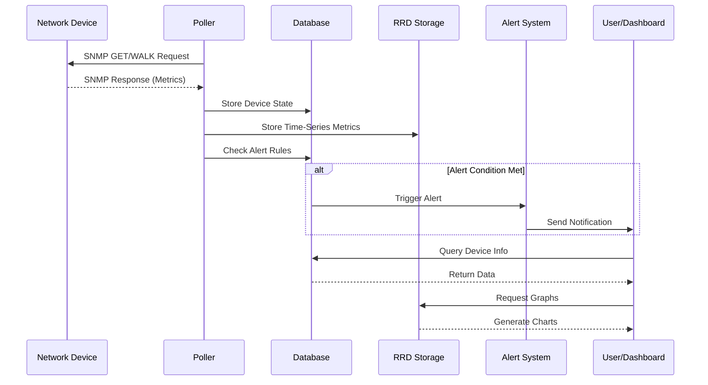

# Infraestructura Red GPON - SERVICIO DHCP KEA

## ¿Qué es LibreNMS?

LibreNMS es un sistema de monitoreo de red de código abierto, que utiliza el protocolo SNMP (Simple Network Management Protocol) 
para supervisar dispositivos de red. Es una plataforma auto-descubrible que permite gestionar y monitorear redes de cualquier tamaño

## Características Principales

- **Descubrimiento automático**: Identifica automáticamente dispositivos en la red utilizando protocolos como CDP, FDP, LLDP, OSPF, BGP, SNMP y ARP.
- **Sistema de alertas flexible**: Notificaciones personalizables a través de email, IRC, Slack y otros medios de comunicación.
- **Soporte multi-protocolo**: Recopila datos de múltiples protocolos incluyendo STP, OSPF, OSPFv3 y BGP.
- **Polling distribuido**: Permite escalar horizontalmente distribuyendo la carga de monitoreo entre múltiples nodos.
- **Facturación de tráfico**: Generación de reportes de uso de ancho de banda basados en cuotas o percentil 95.
- **API completa**: Interfaz de programación para gestionar, graficar y obtener datos del sistema.
- **Múltiples métodos de autenticación**: Soporte para MySQL, LDAP, Active Directory, HTTP y Radius.
- **Integración con Syslog**: Centraliza logs del sistema para análisis y alertas.
- **Monitoreo de servicios**: Compatible con plugins de Nagios para supervisión de servicios.
- **Backup de configuraciones**: Integración con Oxidized y RANCID para respaldo de configuraciones de dispositivos.

## Arquitectura del Sistema

LibreNMS se compone de varios servicios fundamentales que trabajan en conjunto para proporcionar capacidades completas de monitoreo:


### Componentes Principales
- **Base de Datos (MariaDB)**: Almacena toda la información de configuración, dispositivos, alertas, eventos y métricas no temporales. Configurada con tablas InnoDB individuales por archivo y soporte completo de UTF-8.
- **Redis**: Actúa como sistema de caché y cola de mensajes para mejorar el rendimiento y coordinar las tareas de polling distribuido. Almacena sesiones de usuario y datos temporales.
- **RRDtool**: Base de datos de series temporales circular que almacena las métricas de rendimiento y genera gráficos históricos de los dispositivos monitoreados.
- **Servidor Web/API**: Interfaz de usuario y API RESTful que permite la gestión, visualización y obtención de datos del sistema.
- **Dispatcher Service**: Servicio crítico que coordina y distribuye las tareas de polling entre los workers disponibles. Sin al menos un dispatcher, el sistema de polling no funcionará.
- **Poller/Discovery Workers**: Procesos que ejecutan el polling SNMP de dispositivos y el descubrimiento automático de la red.
- **Syslog-ng**: Receptor de mensajes syslog que centraliza logs de dispositivos de red para análisis y generación de alertas.
- **SNMP Trapd**: Manejador de traps SNMP que recibe y procesa mensajes TRAP e INFORM en el puerto UDP 162.
- **MSMTP**: Servicio de relay de correo para el envío de notificaciones y alertas por email.

## Funcionamiento del Sistema de Monitoreo

LibreNMS opera mediante un ciclo continuo de recopilación, almacenamiento y análisis de datos de red:



### Proceso de Polling

El **polling** es el proceso mediante el cual LibreNMS recopila información de los dispositivos:

1. El **Dispatcher** asigna dispositivos a workers disponibles según la carga del sistema.
2. Los **Pollers** envían consultas SNMP (GET/WALK) a los dispositivos objetivo.
3. Los dispositivos responden con sus métricas actuales (uso de CPU, memoria, interfaces, etc.).
4. Los datos se procesan y almacenan en la base de datos MariaDB y RRDtool.
5. El sistema evalúa las reglas de alertas configuradas.
6. Si se cumple alguna condición de alerta, se envían notificaciones.

### Protocolo SNMP

SNMP (Simple Network Management Protocol) es el protocolo que LibreNMS utiliza para comunicarse con dispositivos de red:

- **Puerto UDP 161**: Usado para consultas SNMP (polling).
- **Puerto UDP 162**: Usado para traps SNMP (notificaciones asíncronas de dispositivos).
- **Community String**: Credencial compartida para autenticación en SNMP v2c.
- **SNMPv3**: Soporte para autenticación y encriptación mejoradas.

## Instalación mediante Docker Compose
### Prerrequisitos

- Docker Engine instalado
- Docker Compose v2 o superior
- Acceso a red con los dispositivos a monitorear
- Puertos disponibles: 8000 (Web), 514 (Syslog), 162 (SNMP Traps)

### Configuración de Variables de Entorno

El archivo `.env` debe contener las variables básicas del sistema:

```bash
TZ=America/Bogota
PUID=1000
PGID=1000
MYSQL_DATABASE=librenms
MYSQL_USER=librenms
MYSQL_PASSWORD=your_secure_password
```

### Servicios del Stack

- **Servicio MariaDB**: Base de datos principal configurada con parámetros optimizados para LibreNMS, incluyendo tablas individuales por archivo y soporte UTF-8.
- **Servicio Redis**: Cache y sistema de colas que mejora el rendimiento y coordina el polling distribuido.
- **Servicio MSMTP**: Relay de correo configurado para enviar notificaciones a través de un servidor SMTP externo (Gmail, Office365, etc.).
- **Servicio LibreNMS**: Contenedor principal que ejecuta la aplicación web y API, expuesto en el puerto 8000.
- **Servicio Dispatcher**: Worker crítico que coordina las tareas de polling; debe ejecutarse al menos una instancia.
- **Servicio Syslog-ng**: Recibe mensajes syslog en puerto 514 TCP/UDP y los procesa para almacenamiento en base de datos.
- **Servicio SNMP Trapd**: Escucha traps SNMP en puerto 162 TCP/UDP y registra eventos en el sistema.

### Proceso de Despliegue

```bash
# Crear estructura de directorios
mkdir -p librenms-docker
cd librenms-docker

# Crear archivo .env con variables necesarias
nano .env

# Crear archivos de configuración
nano librenms.env
nano msmtpd.env

# Crear compose.yml con la configuración proporcionada
nano compose.yml

# Iniciar servicios
docker compose up -d

# Verificar estado de contenedores
docker compose ps

# Revisar logs
docker compose logs -f librenms
```

### Acceso a la Interfaz Web

Una vez iniciados los servicios, la interfaz web estará disponible en `http://IP_SERVIDOR:8000`. 

## Configuración del Sistema

### Configuración de LibreNMS

El archivo `librenms.env` contiene parámetros críticos de la aplicación:

- **MEMORY_LIMIT**: Límite de memoria PHP (256M recomendado para instalaciones medianas).
- **MAX_INPUT_VARS**: Número máximo de variables de entrada (1000 mínimo).
- **CACHE_DRIVER/SESSION_DRIVER**: Configurados para usar Redis mejorando el rendimiento.
- **LIBRENMS_SNMP_COMMUNITY**: Community string por defecto para agregar dispositivos.

### Configuración de SNMP

Para monitorear dispositivos, deben estar configurados para responder a consultas SNMP
Para recibir logs de dispositivos, configurar el envío de syslog hacia el servidor LibreNMS en puerto 514:


## Agregando Dispositivos a LibreNMS

### Mediante la Interfaz Web

1. Acceder al dashboard de LibreNMS
2. Click en **Devices** → **Add Device**
3. Ingresar la dirección IP del dispositivo
4. Configurar el community string (o credenciales SNMPv3)
5. Seleccionar la versión SNMP apropiada
6. Click en **Add Device**

El sistema intentará conectarse al dispositivo y, si tiene éxito, comenzará a recopilar información automáticamente.

### Mediante Descubrimiento Automático

LibreNMS puede descubrir dispositivos automáticamente mediante protocolos de descubrimiento:

1. Ir a **Settings** → **Discovery**
2. Habilitar protocolos deseados (xDP, OSPF, BGP, ARP)
3. Configurar rangos de red a escanear
4. El sistema descubrirá y agregará dispositivos automáticamente

## Monitoreo y Visualización

### Dashboard Principal

El dashboard proporciona una vista general del estado de la red, incluyendo:

- Estado de disponibilidad de dispositivos
- Alertas activas y reconocidas
- Gráficos de rendimiento de interfaces críticas
- Eventos recientes del sistema

### Métricas Monitoreadas

LibreNMS recopila automáticamente múltiples métricas de cada dispositivo:

- **Interfaces de red**: Tráfico entrante/saliente, errores, descartes, estado operacional
- **Recursos del sistema**: Uso de CPU, memoria RAM, almacenamiento
- **Sensores**: Temperatura, voltaje, corriente, ventiladores
- **Protocolos de routing**: Estados de vecindades OSPF, BGP, rutas

