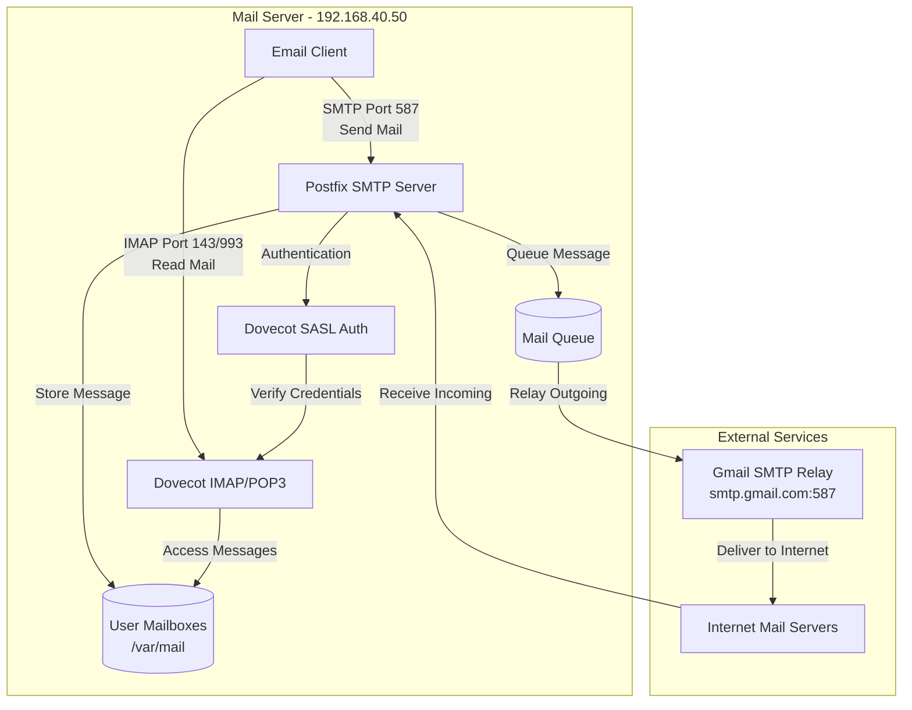
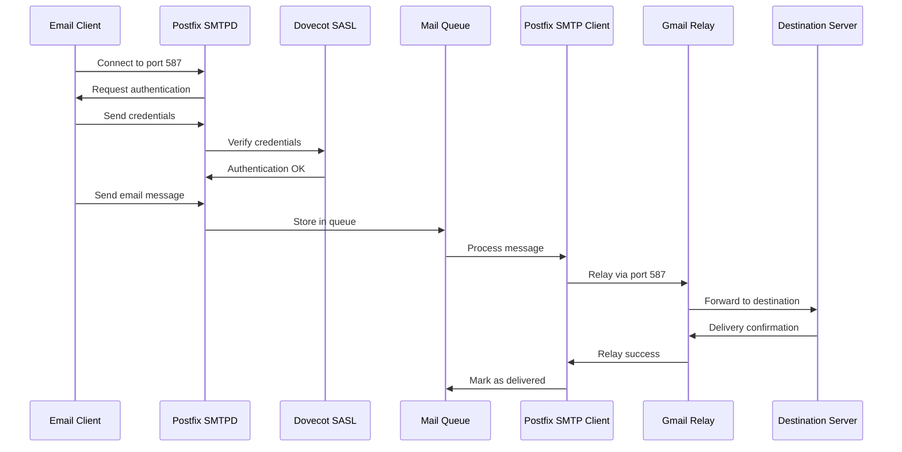
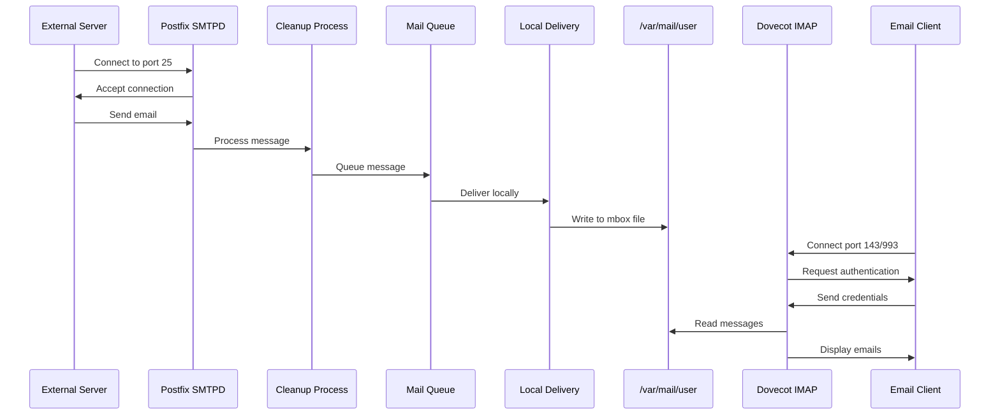
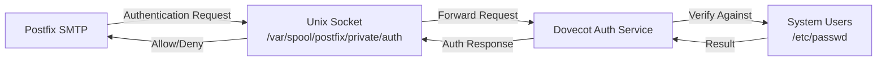

# Infraestructura Red GPON - Servicio SMTP/IMAP

## Descripción General

El servicio de correo electrónico implementado en este proyecto integra Postfix como servidor SMTP (Simple Mail Transfer Protocol) 
y Dovecot como servidor IMAP/POP3.
Este sistema permite a los usuarios de la red GPON enviar y recibir correos electrónicos, utilizando Gmail como relay para el correo saliente.

## ¿Qué es Postfix?
Postfix es un agente de transferencia de correo (Mail Transfer Agent - MTA) moderno y robusto diseñado para ser rápido, seguro y fácil de administrar. 
Desarrollado como alternativa a Sendmail, Postfix maneja el enrutamiento y la entrega de correos electrónicos mediante una arquitectura modular compuesta 
por múltiples procesos pequeños que trabajan de forma independiente.

### Características Principales de Posfix

- Cada componente realiza una tarea específica, lo que mejora la seguridad y el rendimiento​
- Soporta formatos de buzón estándar como mbox y Maildir​
- Diseñado con principios de mínimo privilegio y aislamiento de procesos​
- Capacidad de reenviar correos a través de servidores externos como Gmail

## ¿Qué es Dovecot?
Dovecot es un servidor de código abierto para IMAP y POP3. Permite a los clientes de correo acceder, leer y gestionar sus mensajes almacenados en el servidor.

### Características Principales de Dovecot

- Protocolos soportados: IMAP, POP3, LMTP y ManageSieve​
- Autenticación SASL: Proporciona autenticación para Postfix a través de un socket Unix​
- Formatos de buzón: Soporta Maildir, mbox, dbox y otros formatos​
- Seguridad TLS/SSL: Cifrado de conexiones para proteger credenciales y datos

## Arquitectura del sistema



## Componentes del Sistema de Correo
### Componentes de Postfix

1. `smtpd`: Servidor SMTP que recibe correos desde clientes o servidores externos​
2. `qmgr (Queue Manager)`: Gestiona la cola de mensajes y coordina la entrega​
3. `smtp`: Cliente SMTP que envía correos a servidores de destino​
4. `cleanup`: Procesa y normaliza los mensajes antes de almacenarlos en cola​
5. `local`: Entrega mensajes a buzones locales del sistema​
6. `master`: Proceso maestro que supervisa todos los demás componentes​

### Componentes de Dovecot
1. `imap-login`: Maneja las conexiones IMAP entrantes​
2. `pop3-login`: Maneja las conexiones POP3 entrantes​
3. `auth`: Sistema de autenticación que verifica credenciales de usuarios​
4. `imap/pop3`: Procesos que gestionan las sesiones de correo activas​
5. `lmtp`: Protocolo local de transferencia de correo para integración con Postfix

---


## Instalación del Servicio

**Paso 1: Instalación de paquetes**:

```bash
# Actualizar repositorios
sudo apt update

# Instalar Postfix
sudo apt install -y postfix

# Instalar Dovecot
sudo apt install -y dovecot-core dovecot-imapd dovecot-pop3d

# Instalar utilidades SASL para autenticación
sudo apt install -y libsasl2-2 libsasl2-modules ca-certificates

# Instalar utilidades de correo
sudo apt install -y mailutils
```

**Paso 2: Configuración de Red**:

La interfaz de red del servidor se configuró mediante netplan, con direccionamiento IPv4 e IPv6:

```bash
# /etc/netplan/netconf.yaml
network:
  version: 2
  renderer: networkd
  ethernets:
    enp0s3:
      addresses:
        - 192.168.40.50/24
        - 2001:db8:40::50/64
      routes:
        - to: default
          via: 192.168.40.1
        - to: default
          via: 2001:db8:40::1
      nameservers:
        addresses: [192.168.20.20, 2001:db8:20::20]
        search: [gponlab.local]
```

Aplicar configuración

```bash
sudo netplan apply
```

**Paso 3: Configuración de Credenciales de Gmail**:

Para utilizar Gmail como relay, se requiere una contraseña de aplicación:

```bash
# Crear archivo de credenciales
sudo nano /etc/postfix/sasl_passwd

# Contenido del archivo:
[smtp.gmail.com]:587 usuario@gmail.com:contraseña_de_aplicacion

# Generar base de datos hash
sudo postmap /etc/postfix/sasl_passwd

# Proteger el archivo
sudo chmod 600 /etc/postfix/sasl_passwd
sudo chmod 600 /etc/postfix/sasl_passwd.db
```

---

## Configuración Postfix

### Archivo main.cf

El archivo `etc/postfix/main.cf` contiene la configuración principal del servidor SNMTP:

#### Configuración Básica
```bash
# Nombre del host del servidor de correo
myhostname = mail.gponlab.local

# Origen del correo
myorigin = /etc/mailname

# Dominios de destino que este servidor acepta
mydestination = $myhostname, gponlab.local, localhost.localdomain, localhost

# Redes confiables autorizadas para relay
mynetworks = 127.0.0.0/8 [::ffff:127.0.0.0]/104 [::1]/128 192.168.0.0/16

# Interfaces de red donde escuchar
inet_interfaces = all
inet_protocols = all
```

#### Configuración de Seguridad y Relay

```bash
# Restricciones de relay SMTP
smtpd_relay_restrictions = permit_mynetworks permit_sasl_authenticated defer_unauth_destination
```

Esta configuración permite:
- `permit_mynetworks`: Redes definidas en mynetworks pueden enviar correo​
- `permit_sasl_authenticated`: Usuarios autenticados mediante SASL pueden enviar correo​
- `defer_unauth_destination`: Rechaza correos no autorizados a destinos externos


#### Configuración TLS/SSL

```bash
# Certificados TLS para conexiones seguras
smtpd_tls_cert_file=/etc/ssl/certs/ssl-cert-snakeoil.pem
smtpd_tls_key_file=/etc/ssl/private/ssl-cert-snakeoil.key
smtpd_tls_security_level=may

# Configuración del cliente SMTP
smtp_tls_CApath=/etc/ssl/certs
smtp_tls_session_cache_database = btree:${data_directory}/smtp_scache
```

#### Autenticación SASL con Dovecot
```bash
# Tipo de SASL: usar Dovecot para autenticación
smtpd_sasl_type = dovecot

# Socket Unix donde Dovecot escucha peticiones de autenticación
smtpd_sasl_path = private/auth
```

Lo anterior permite que Postfix utilice el sistema de autenticación de Dovecot para verificar usuarios.

#### Relay SMTP con Gmail

```bash
# Servidor relay para correo saliente
relayhost = [smtp.gmail.com]:587

# Habilitar autenticación SASL para el cliente
smtp_sasl_auth_enable = yes

# Archivo con credenciales de autenticación
smtp_sasl_password_maps = hash:/etc/postfix/sasl_passwd

# Opciones de seguridad SASL
smtp_sasl_security_options = noanonymous

# Forzar cifrado TLS
smtp_tls_security_level = encrypt

# Archivo de certificados CA
smtp_tls_CAfile = /etc/ssl/certs/ca-certificates.crt
```
---
### Archivo master.cf

El archivo `/etc/postfix/master.cf` define los servicios y procesos de Postfix:

#### Puerto de Envío (Submission Port 587)
```bash
submission inet n       -       y       -       -       smtpd
  -o syslog_name=postfix/submission
  -o smtpd_tls_security_level=encrypt
  -o smtpd_sasl_auth_enable=yes
  -o smtpd_reject_unlisted_recipient=no
  -o smtpd_client_restrictions=permit_sasl_authenticated,reject
  -o milter_macro_daemon_name=ORIGINATING
```

El puerto 587 es el estándar moderno para envío de correo autenticado (Mail Submission):​

- Requiere autenticación SASL obligatoria​
- Usa cifrado TLS mediante STARTTLS​
- Previene spam al requerir credenciales válidas​

### Configuración de Dovecot

#### Archivo `10-auth.conf`
Configuración de mecanismos de autenticación:

```bash
# Mecanismos de autenticación permitidos
auth_mechanisms = plain login
```

- `plain`: Autenticación con usuario y contraseña en texto plano (protegido por TLS)​
- `login`: Método alternativo de autenticación compatible con clientes antiguos

```bash
# Incluir autenticación del sistema Unix
!include auth-system.conf.ext
```
Esto permite usar las cuentas de usuario del sistema (/etc/passwd) para autenticación de correo.

#### Archivo 10-mail.conf
Configuración de ubicación y formato de buzones:

```bash
# Formato y ubicación de buzones
mail_location = mbox:~/mail:INBOX=/var/mail/%u
```
Esta configuración utiliza el formato **mbox**:
- Formato mbox: Todos los mensajes de un buzón se almacenan en un único archivo​
- INBOX: Ubicado en `/var/mail/usuario​`
- Otros buzones: Almacenados en `~/mail/` del usuario​
- Variables: %u se expande al nombre de usuario

```bash
# Grupo privilegiado para acceso a buzones del sistema
mail_privileged_group = mail
```

Permite a Dovecot acceder a `/var/mail/` que típicamente pertenece al grupo `mail`.

```bash
# Configuración del namespace INBOX
namespace inbox {
  inbox = yes
}
```

Define el espacio de nombres principal donde reside el buzón INBOX del usuario.

#### Archivo 10-master.conf

Configuración de servicios y sockets

```bash
# Socket Unix para autenticación de Postfix
unix_listener /var/spool/postfix/private/auth {
  mode = 0666
  user = postfix
  group = postfix
}
```

Este socket permite la comunicación entre Dovecot y Postfix para autenticación SASL:
- Ubicación: Dentro del chroot de Postfix para seguridad​
- Permisos: Accesible por el usuario `postfix​`
- Función: Postfix envía credenciales a Dovecot para validación


#### Archivo 10-ssl.conf

Configuración de cifrado SSL/TLS

```bash
# Habilitar SSL/TLS
ssl = yes

# Certificado y clave privada
ssl_cert = </etc/dovecot/private/dovecot.pem
ssl_key = </etc/dovecot/private/dovecot.key

# Directorio de certificados CA confiables
ssl_client_ca_dir = /etc/ssl/certs
```
El cifrado TLS protege las credenciales y el contenido de los correos en tránsito:
- Puerto 993: IMAPS (IMAP sobre SSL)​
- Puerto 995: POP3S (POP3 sobre SSL)​
- Puerto 143/110: IMAP/POP3 con STARTTLS opcional

### Flujo de Funcionamiento

**Flujo de Envío de Correo**



**Flujo de Recepción de Correo**




### Integración Postfix-Dovecot

La integración entre Postfix y Dovecot se realiza mediante SASL (Simple Authentication and Security Layer):



## Práctica de SMTP
En este proyecto usaremos Thunderbird para conectarnos a nuestro servidor de correo basado en Postfix (SMTP) y Dovecot (IMAP). El propósito es verificar el correcto funcionamiento del envío y recepción de correos en la infraestructura GPON, permitiendo crear y gestionar los usuarios necesarios para probar todas las funcionalidades del servidor adecuadamente. Thunderbird nos permite configurar fácilmente las opciones del servidor de entrada y salida, así como los puertos utilizados. Para la práctica, se instaló Thunderbird en dos clientes diferentes, asegurando una prueba integral del sistema.

### Que es Thunderbird?
Thunderbird es un cliente de correo electrónico gratuito, de código abierto y multiplataforma, desarrollado por la Fundación Mozilla. Permite gestionar múltiples cuentas de correo, enviar y recibir mensajes, organizar bandejas de entrada, y acceder a correos almacenados en servidores externos. También brinda seguridad y privacidad mediante conexiones cifradas y soporte para los protocolos POP, IMAP y SMTP, entre otros.

### Instalación y Configuración de Usuarios
#### Instalación.
Para la instalación de Thunderbird, visita la página oficial y sigue los pasos que se especifican en la instalación:
https://www.thunderbird.net/es-ES/thunderbird/all/

Allí podrás descargar la versión adecuada según tu sistema operativo. En este proyecto se utilizó la versión para Windows en los dos Clientes, instalada siguiendo el asistente habitual.

#### Configuración de Usuarios
En este caso se crearan dos usuarios uno diferente en cada pc cliente, estos usuarios deben ya haber sido creados con anterioridad en el servidor SMTP. En este proyecto se crearon dos usuarios con los siguientes paramentros.

##### Usuario 1
- Nombre de Usuario: user1
- Contraseña: pass
##### Usuario 2
- Nombre de Usuario: user2
- Contraseña: pass
  
Una vez instalada la aplicación de Thunderbird en los equipos cliente, ábrela para comenzar con la creación del primer usuario. Asegúrate de que el equipo esté conectado a la red del proyecto GPON para que Thunderbird pueda detectar correctamente el servidor de correo configurado.

#### Creación del primer usuario en Thunderbird
- Al iniciar la creación de la cuenta, introduce tus datos: nombre completo, dirección de correo (por ejemplo, user1@gponlab.local) y al final despues de haber reconocido el servidor y sus configuraciones te pedira la contraseña.


- Pulsa el botón Continuar, y Thunderbird buscará automáticamente la configuración del servidor de correos tanto de entrada (IMAP) como de salida (SMTP) con los parámetros definidos en el servidor (IP, puertos, seguridad).

- Si Thunderbird no reconoce la configuración automáticamente, se puede ingresar manualmente la información del servidor, incluyendo IP, puertos y métodos de seguridad.

- Repite este proceso en el segundo equipo para configurar el usuario user2@gponlab.local.

### Prueba
Con ambos usuarios creados y configurados, la prueba consiste en enviar y recibir mensajes entre ellos, funcionando de manera similar a cualquier proveedor de correo como Gmail u Outlook.

Para enviar un correo, en Thunderbird selecciona Escribir un mensaje nuevo.


Completa los campos: destinatario (por ejemplo, user2@gponlab.local), asunto y cuerpo del mensaje. También puedes adjuntar archivos multimedia como imágenes o videos.


#### Nota Importante sobre Certificados
El servidor SMTP configurado en esta infraestructura no posee un certificado SSL verificado por una autoridad certificadora confiable, por lo que al intentar enviar un correo, Thunderbird mostrará una advertencia de seguridad.
Thunderbird permite omitir esta advertencia para continuar con el envío, aunque advierte que hacerlo puede representar un riesgo. Esta configuración es común en entornos de laboratorio o pruebas donde se usan certificados autofirmados como el nuestro.

Al enviar el correo, Thunderbird lo entregará al servidor SMTP en el puerto 587 configurado. El servidor almacenará el mensaje y lo entregará al buzón del usuario destinatario para su lectura a través del servidor IMAP en el mismo servidor.

Para correos dirigidos a destinatarios externos, el servidor SMTP local lo enviará primero al relay de Gmail configurado, que luego se encargará de la entrega final al servidor externo correspondiente.


