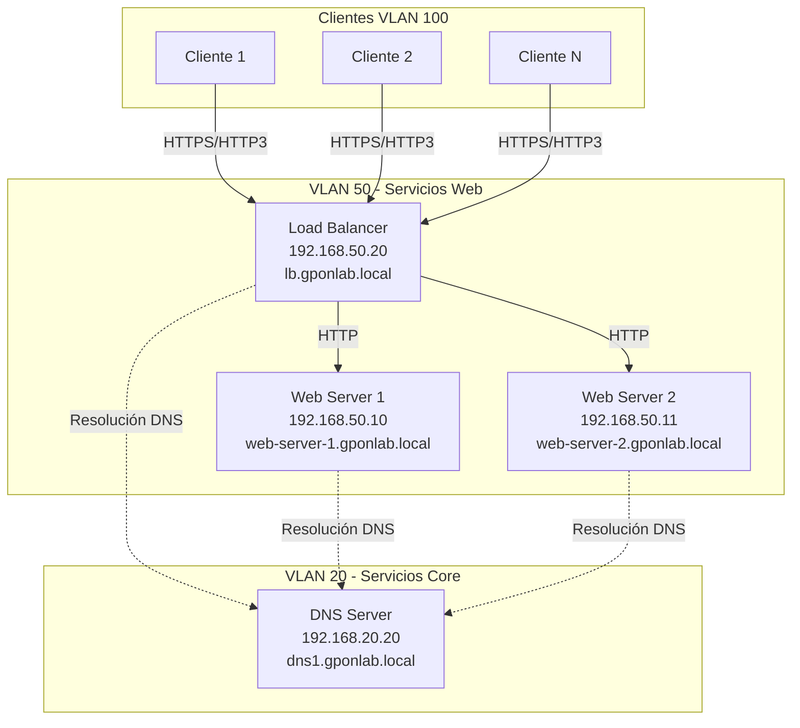
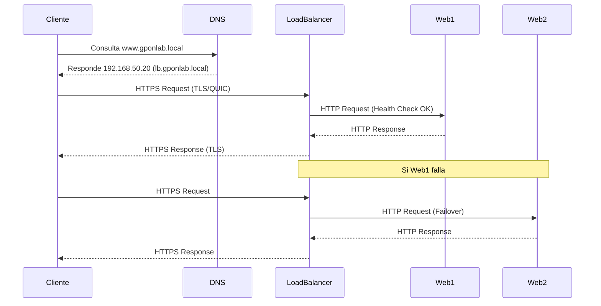
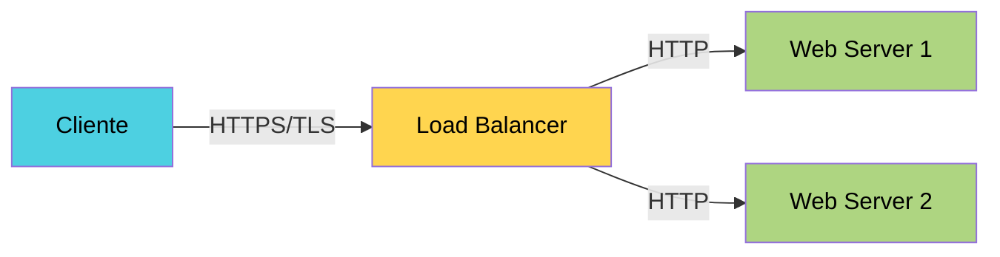

# Infraestructua Red GPON - SERVICIO WEB

## Implementación Caddy Web Server v2 + HTTP/3 (QUIC)

---

## Descripción General del Servicio Web.

El servicio web implementado utiliza Caddy Web Server v2. Maneja soporte nativo para HTTP/3 (QUIC), TLS automático y proxy
inverso integrado. Maneja automáticamente certificados, redirección HTTPS y balanceo de carga sin configuraciones complejas.

Un servidor web corresponde a un software que entrega contenido web (como páginas HTML, imágenes, o archivos) a los clientes
que lo solicitan mediante el protocolo HTTP o HTTPS. Cuando un cliente (como un navegador) solicita una página, el servidor web
recibe la petición, la procesa y responde con el contenido solicitado. En este caso, los servidores `web-server-1` y `web-server-2`
alojan el contenido del sitio en cuestión.

Por otra parte, un proxy inverso (reverse proxy) actúa como intermediario entre los clientes y los servidores backend.
En lugar de que los clientes accedan directamente a cada servidor web, el proxy inverso (_Load Balancer_) recibe todas las solicitudes,
la distribuye entre los servidores displonibles y devuelve las respuestas al cliente. Esto permite:

 - Mejorar la disponibilidad en terminos de _failover_ si un servidor falla.
 - Incrementar el rendimiento distribuyendo carga entre varios servidores.
 - Aumentar la seguridad, en el sentido en el que se oculta la infraestructura interna al público.
 - Facilita la terminación TLS, manejando cifrado desde un solo punto.

Caddy incluye un módulo de balanceo de carga con varios algoritmos o políticas de distribución que determinan cómo reparte las solicitudes
entre los servidores backend.

- round_robin: distribuye las solicitudes de forma circular y equitativa entre los servidores (la primera va a web1, la segunda a web2, la tercera otra vez a web1, y así sucesivamente).
- least_conn: envía la solicitud al servidor con menos conexiones activas.
- random: selecciona aleatoriamente un servidor disponible para cada solicitud.
- ip_hash: asigna siempre al mismo servidor las solicitudes que provienen de una misma dirección IP.
---

## Arquitectura del Sistema




### Flujo de Tráfico



### Tabla de Servidores

| Servidor | Hostname | IPv4 | IPv6 | Función | Puertos |
|----------|----------|------|------|---------|---------|
| Load Balancer | lb.gponlab.local | 192.168.50.20/25 | 2001:db8:50::20/64 | Proxy inverso y balanceo de carga | 80, 443 (TCP/UDP) |
| Web Server 1 | web-server-1.gponlab.local | 192.168.50.10/25 | 2001:db8:50::10/64 | Servidor web principal | 80 |
| Web Server 2 | web-server-2.gponlab.local | 192.168.50.11/25 | 2001:db8:50::11/64 | Servidor web espejo | 80 |
| DNS Server | dns1.gponlab.local | 192.168.20.20/24 | 2001:db8:20::20/64 | Resolución de nombres | 53 |

### Configuración de Red

| Parámetro | Valor |
|-----------|-------|
| VLAN | 50 |
| Subred IPv4 | 192.168.50.0/25 |
| Subred IPv6 | 2001:db8:50::/64 |
| Gateway | 192.168.50.1 |
| DNS Primario | 192.168.20.20 |
| DNS Secundario | 1.1.1.1 |
| Dominio | gponlab.local |

---

## Configuración inicial

### Paquetes del Sistema

```shell
sudo apt update && sudo apt upgrade -y
sudo apt install -y curl wget git net-tools
```

### Verificación de Conectividad

```shell
# Verificar conectividad a Internet
ping -c 4 8.8.8.8

# Verificar resolución DNS
nslookup google.com
nslookup dns1.gponlab.local
```

---

## Instalación de Caddy

### Instalación en las 3 VMs

Estos comandos son ejecutados en cada una de las tres máquinas virtuales (load-balancer, web-server-1, web-server-2).

#### Versiones estables:

```shell
sudo apt install -y debian-keyring debian-archive-keyring apt-transport-https curl
curl -1sLf 'https://dl.cloudsmith.io/public/caddy/stable/gpg.key' | sudo gpg --dearmor -o /usr/share/keyrings/caddy-stable-archive-keyring.gpg
curl -1sLf 'https://dl.cloudsmith.io/public/caddy/stable/debian.deb.txt' | sudo tee /etc/apt/sources.list.d/caddy-stable.list
chmod o+r /usr/share/keyrings/caddy-stable-archive-keyring.gpg
chmod o+r /etc/apt/sources.list.d/caddy-stable.list
sudo apt update
sudo apt install caddy
```

#### Verificar Instalación

```shell
# Verificar versión de Caddy
caddy version

# Verificar estado del servicio
sudo systemctl status caddy

# Habilitar inicio automático
sudo systemctl enable caddy
```

### Configuración de Firewall

```shell
# Instalar UFW si no está instalado
sudo apt install ufw -y

# Permitir SSH
sudo ufw allow 22/tcp

# Permitir HTTP
sudo ufw allow 80/tcp

# Permitir HTTPS
sudo ufw allow 443/tcp

# Permitir QUIC/HTTP3 (UDP)
sudo ufw allow 443/udp

# Activar firewall
sudo ufw enable

# Verificar reglas
sudo ufw status verbose
```

---

## Configuración de Red

### Configuración de Netplan

Netplan es el sistema de configuración de red por defecto en Ubuntu Server. Los archivos de configuración se encuentran en `/etc/netplan/`.

#### Estructura del Archivo Netplan

```yaml
network:
  version: 2
  ethernets:
    [interfaz]:
      addresses: [IPs estáticas]
      routes: [rutas]
      nameservers: [servidores DNS]
```

#### Load Balancer (192.168.50.20)

Crear o editar `/etc/netplan/01-netcfg.yaml`:

```shell
sudo nano /etc/netplan/01-netcfg.yaml
```

Ver archivo: `netplan-lb.yaml`

#### Web Server 1 (192.168.50.10)

Crear o editar `/etc/netplan/01-netcfg.yaml`:

```shell
sudo nano /etc/netplan/01-netcfg.yaml
```

Ver archivo: `netplan-web1.yaml`

#### Web Server 2 (192.168.50.11)

Crear o editar `/etc/netplan/01-netcfg.yaml`:

```shell
sudo nano /etc/netplan/01-netcfg.yaml
```

Ver archivo: `netplan-web2.yaml`

### Aplicar Configuración de Red

```shell
# Validar sintaxis del archivo
sudo netplan try

# Si todo está correcto, aplicar permanentemente
sudo netplan apply

# Verificar configuración aplicada
ip addr show enp0s3
ip route show
```

### Configurar Hostname

#### En Load Balancer

```shell
sudo hostnamectl set-hostname lb.gponlab.local
```

#### En Web Server 1

```shell
sudo hostnamectl set-hostname web-server-1.gponlab.local
```

#### En Web Server 2

```shell
sudo hostnamectl set-hostname web-server-2.gponlab.local
```

### Archivo /etc/hosts

Configurar en las 3 máquinas para resolución local:

```shell
sudo nano /etc/hosts
```

Contenido:

```
127.0.0.1 localhost
::1 localhost

# VLAN 50 - Web Services
192.168.50.20 lb.gponlab.local lb
192.168.50.10 web-server-1.gponlab.local web-server-1
192.168.50.11 web-server-2.gponlab.local web-server-2

2001:db8:50::20 lb.gponlab.local
2001:db8:50::10 web-server-1.gponlab.local
2001:db8:50::11 web-server-2.gponlab.local

# DNS
192.168.20.20 dns1.gponlab.local dns1
```

### Verificación de Conectividad

```shell
# Verificar gateway
ping -c 4 192.168.50.1

# Verificar DNS
ping -c 4 dns1.gponlab.local

# Verificar Internet
ping -c 4 google.com

# Verificar resolución de nombres internos
nslookup lb.gponlab.local
nslookup web-server-1.gponlab.local
nslookup web-server-2.gponlab.local
nslookup www.gponlab.local
```

---

## Configuración de Servidores Web

### Estructura de Directorios

```shell
# Crear directorio para el sitio web
sudo mkdir -p /var/www/gponlab

# Crear directorio para logs
sudo mkdir -p /var/log/caddy

# Asignar permisos correctos
sudo chown -R caddy:caddy /var/www/gponlab
sudo chown -R caddy:caddy /var/log/caddy
sudo chmod -R 755 /var/www/gponlab
```

### Contenido Web

#### Web Server 1

Crear archivo `index.html`:

```shell
sudo nano /var/www/gponlab/index.html
```

Ver archivo: `index-web1.html`

#### Web Server 2

Crear archivo `index.html`:

```shell
sudo nano /var/www/gponlab/index.html
```

Ver archivo: `index-web2.html`

### Archivo Caddyfile

#### Web Server 1

Editar `/etc/caddy/Caddyfile`:

```shell
sudo nano /etc/caddy/Caddyfile
```

Ver archivo: `Caddyfile-web1`

**Explicación de la configuración:**

- **Bloque global `{}`**: Configuración general de Caddy
  - `log { level INFO }`: Nivel de logging informativo
  
- **Bloque `:80`**: Escucha en puerto 80 (HTTP)
  - `bind web-server-1.gponlab.local`: Se asocia al hostname específico
  - `root * /var/www/gponlab`: Directorio raíz del sitio web
  - `file_server`: Habilita el servidor de archivos estáticos
  
- **`handle /health`**: Endpoint para health checks del load balancer
  - Responde con código 200 y mensaje "OK - web1 healthy"
  
- **`log`**: Configuración de logs
  - `output file`: Ruta del archivo de log
  - `roll_size 10mb`: Rotar log al alcanzar 10MB
  - `roll_keep 5`: Mantener 5 archivos de log rotados

#### Web Server 2

Editar `/etc/caddy/Caddyfile`:

```shell
sudo nano /etc/caddy/Caddyfile
```

Ver archivo: `Caddyfile-web2`

La configuración es idéntica a Web Server 1, cambiando solo:
- El hostname en `bind`
- El mensaje de respuesta en `/health`
- La ruta del log

### Validar y Reiniciar Caddy

```shell
# Validar sintaxis del Caddyfile
sudo caddy validate --config /etc/caddy/Caddyfile

# Si la validación es exitosa, reiniciar Caddy
sudo systemctl restart caddy

# Verificar estado del servicio
sudo systemctl status caddy

# Ver logs en tiempo real
sudo journalctl -u caddy -f
```

---

## Configuración del Load Balancer

### Concepto de Terminación TLS

El Load Balancer implementa **terminación TLS** (TLS Termination), lo que significa:

1. Los clientes se conectan al LB mediante HTTPS/QUIC (cifrado)
2. El LB descifra el tráfico y valida certificados
3. El LB distribuye tráfico a backends mediante HTTP simple
4. Los backends responden con HTTP
5. El LB cifra las respuestas y las envía a los clientes

Esto simplifica configuración de certificados (solo en el LB); Reduce overhead de cifrado en backends; Permite inspección de tráfico en el LB y finalmente facilita health checks y balanceo de carga



### Archivo Caddyfile del Load Balancer

Editar `/etc/caddy/Caddyfile`:

```shell
sudo nano /etc/caddy/Caddyfile
```

Ver archivo: `Caddyfile-lb`

**Explicación:**

#### Bloque Global

```
{
    log {
        level INFO
    }
    local_certs
}
```

- `local_certs`: Habilita generación de certificados auto-firmados para entornos locales

#### Configuración para www.gponlab.local

```
www.gponlab.local {
    tls internal
    encode zstd gzip
    reverse_proxy http://web-server-1.gponlab.local:80 http://web-server-2.gponlab.local:80 {
        ...
    }
}
```

**Directivas principales:**

- **`tls internal`**: Genera certificado auto-firmado interno
- **`encode zstd gzip`**: Compresión de respuestas (zstd preferido, gzip fallback)
- **`reverse_proxy`**: Configuración del proxy inverso

**Configuración del Reverse Proxy:**

- **Backends**: `http://web-server-1.gponlab.local:80` y `http://web-server-2.gponlab.local:80`
  - Usa HTTP (no HTTPS) para comunicación interna
  - Resuelve nombres mediante DNS configurado

- **`lb_policy round_robin`**: Algoritmo de balanceo
  - Distribuye requests de forma circular entre backends
  - Alternativas: `random`, `least_conn`, `ip_hash`

- **Health Checks**:
  ```
  health_uri /health
  health_interval 5s
  health_timeout 3s
  health_status 2xx
  ```
  - Consulta `/health` cada 5 segundos
  - Timeout de 3 segundos
  - Espera código HTTP 2xx (200-299)
  - Si un backend falla, lo marca como inactivo automáticamente

- **Headers upstream** (enviados a backends):
  ```
  header_up X-Real-IP {remote_host}
  header_up X-Forwarded-For {remote_host}
  header_up X-Forwarded-Proto {scheme}
  ```
  - Preserva IP original del cliente
  - Indica protocolo original (http/https)

#### Logging

```
log {
    output file /var/log/caddy/access.log {
        roll_size 10mb
        roll_keep 5
    }
}
```

- Logs en formato estructurado (JSON)
- Rotación automática cada 10MB
- Mantiene últimos 5 archivos

### Validar y Reiniciar

```shell
# Validar configuración
sudo caddy validate --config /etc/caddy/Caddyfile

# Reiniciar servicio
sudo systemctl restart caddy

# Verificar estado
sudo systemctl status caddy

# Ver logs
sudo journalctl -u caddy -n 50 --no-pager
```

---

## Contenido Web

### Estructura del HTML

Los archivos HTML implementan:

1. **Identificación del servidor** (WEB1 o WEB2)
3. **Información de la infraestructura GPON**
4. **Detección de protocolo** mediante JavaScript

### Componentes importantes del HTML

#### JavaScript para Detección de Protocolo

```javascript
if (window.performance && performance.getEntriesByType) {
    const navTiming = performance.getEntriesByType('navigation')[0];
    if (navTiming && navTiming.nextHopProtocol) {
        const protocol = navTiming.nextHopProtocol;
        // Detecta h3 (HTTP/3), h2 (HTTP/2), http/1.1
    }
}
```

**Protocolos detectados:**
- `h3`, `h3-29`, `h3-32`: HTTP/3 sobre QUIC
- `h2`: HTTP/2
- `http/1.1`: HTTP/1.1

---

## Logs y Monitoreo

### Ubicación de Logs

| Servidor | Ubicación del Log | Descripción |
|----------|-------------------|-------------|
| Load Balancer | `/var/log/caddy/access.log` | Requests recibidos por el LB |
| Web Server 1 | `/var/log/caddy/web1-access.log` | Requests procesados por web1 |
| Web Server 2 | `/var/log/caddy/web2-access.log` | Requests procesados por web2 |
| System Logs | `journalctl -u caddy` | Logs del servicio systemd |

### Formato de Logs

Caddy utiliza formato JSON para logs estructurados:

```json
{
  "level": "info",
  "ts": 1699456789.123,
  "logger": "http.log.access",
  "msg": "handled request",
  "request": {
    "remote_ip": "192.168.100.50",
    "proto": "HTTP/2.0",
    "method": "GET",
    "host": "www.gponlab.local",
    "uri": "/",
    "headers": {...}
  },
  "duration": 0.012,
  "size": 4567,
  "status": 200
}
```

---

## Verificación y Pruebas

### Pruebas Locales

#### En cada Web Server

```shell
# Verificar que responde localmente
curl http://localhost

# Verificar health check
curl http://localhost/health

# Verificar desde otra VM en VLAN 50
curl http://192.168.50.10  # Para web1
curl http://192.168.50.11  # Para web2
```

#### En Load Balancer

```shell
# Verificar HTTPS localmente
curl -k https://localhost

# Verificar por dominio
curl -k https://www.gponlab.local

# Verificar que balancea entre backends
for i in {1..20}; do
  curl -k https://localhost 2>/dev/null | grep -oP '(WEB1|WEB2)'
  sleep 1
done
```

### Pruebas desde Cliente

Desde una máquina en VLAN 100 o cualquier red con acceso a VLAN 50:

```shell
# Verificar resolución DNS
nslookup www.gponlab.local

# Probar HTTP
curl http://www.gponlab.local

# Probar HTTPS
curl -k https://www.gponlab.local

# Verificar headers HTTP/3
curl -k -I https://www.gponlab.local
```

### Pruebas de Failover

#### Simular fallo de Web Server 1

```shell
# En web-server-1, detener Caddy
sudo systemctl stop caddy

# Desde Load Balancer, verificar logs
sudo journalctl -u caddy -f

# Desde cliente, hacer requests
# Deberían ir todos a web2
for i in {1..10}; do
  curl -k https://www.gponlab.local 2>/dev/null | grep -oP '(WEB1|WEB2)'
  sleep 1
done
```

**Resultado esperado:** Solo debe aparecer "WEB2"

#### Recuperación del servidor

```shell
# En web-server-1, iniciar Caddy
sudo systemctl start caddy

# Verificar health check
curl http://localhost/health

# Desde Load Balancer, los requests deberían balancearse nuevamente
```

### Pruebas con Navegador

#### Firefox / Chrome

1. Abrir navegador
2. Navegar a: `https://www.gponlab.local`
3. Aceptar certificado auto-firmado (advertencia de seguridad)
4. Verificar que carga la página

#### Verificar HTTP/3 en Chrome

1. Abrir Chrome
2. Ir a: `chrome://net-internals/#http2`
3. Buscar `www.gponlab.local`
4. Debería mostrar protocolo `h3` (HTTP/3)

#### DevTools para verificar protocolo

1. Abrir DevTools (F12)
2. Tab "Network"
3. Recargar página
4. Click en el primer request
5. En "Headers", buscar "Protocol"
6. Debería mostrar `h3` o `HTTP/3`

